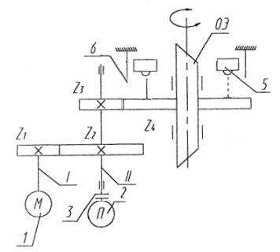

# 1. Введение

## 1.1. Техническое задание

| Наименование параметра        | Обозначение      | Значение |
| ---                           | ---              | --- |
| Диаметр светового потока на входе ОЭ                        |                  | 40 $мм$  |
| Максимальная скорость вращения ОЭ                     | $\omega_н$       | 1.4 $\frac{об.}{с}$ |
| Максимальное угловое 
ускорение вращения ОЭ           | $\varepsilon_н$  | 25 $с^{-2}$ |
| Максимальный угол поворота ОЭ | $\alpha_{{вых вала}}$ | 180$^\circ$ |
| Точность отработки положения ОЭ                              | $\delta_{{\Sigma ТЗ}}$ | 20$'$ |  |
| Рабочее положение оптической оси ОЭ                          |                  | Вертикальное |
| Характер производства         |                  | Серийное |
| Срок службы эксплуатации      | $L_{h}$          | 1000 $ч$ |
| Температура эксплуатации      | $t_{{жар}}$..$t_{{хол}}$     | +40..-40$^\circ С$ |

Таблица 1. Условия задания.

## 1.2. Описание разрабатываемого ЭМП

**Область применения**: устройства вращения изображения, проекционные приборы, оптические прицелы.

**Схема и краткое описание**:
ЭМП вращения изображения предназначен для поворота изображения предмета 
на произвольный угол с помощью вращающего оптического элемента (ОЭ), вращаемого
вокруг оптической оси ПУ.

Перемещение ОЭ осуществляется по сигналам, вырабатываемым
вычислительным устройством (ВУ), с помощью следящего привода, блок
схема которого приведена на рисунке 1. Следящая система представляет
собой замкнутый контур, состоящий из элемента сравнения ЭС, усилителя У,
исполнительного двигателя Д, редуктора Р с ОЭ , установленном на его
выходном звене, и элемента обратной связи ЭОС.

Ограничитель движения ОД входит в кинематическую цепь ЭМП для
ограничения пределов вращения визирного ОЭ.
Для поворота ОЭ с ВУ на вход следящей системы поступает сигнал
$U_{вх}$, значение которого соответствует вводимому углу азимута (угла
поворота ОЭ) $\phi_{ОЭ}$. После усиления сигнала $U_{вх}$ поступает на управляющую
обмотку двигателя.

Вал двигателя начинает вращаться и приводит в движение
кинематические цепи ЭМП. При вращении вала ЭОС вырабатывается
напряжение обратной связи $U_{ос}$ (противоположное по знаку $U_{вх}$), которое
поступает на ЭС, где сигналы суммируются. Результирующий сигнал (сигнал
ошибки) $\Delta U = U_{вх} - U_{ос}$ поступает на вход усилителя. Двигатель работает при
$\Delta U \neq 0$, стремясь все время поддерживать равенство $U_{вх} = U_{ос}$. При $\Delta U = 0$
двигатель останавливается, а при $\Delta U < 0$ - вращается в обратную сторону.
Таким образом, угол поворота ОЭ будет изменяться пропорционально
изменению величины входного сигнала $U_{вх}$.

На рисунке 2 приведена примерная кинематическая схема привода.
Движение от двигателя 1 с помощью двухступенчатого редуктора 
передается на выходное колесо $Z_4$, на котором установлен ОЭ. Элемент
обратной связи 2 соединяется с редуктором с помощью муфты 3. Для
вращения ОЭ в заданных пределах используется ограничитель движения ОД,
состоящий из микровыключателей 5 и механических упоров 6.

## 1.3. Дополнительные указания по проектированию

В записке необходимо приводить эскизы рассчитываемых элементов и
узлов схемы силовых воздействий, эпюры изгибающих и крутящих
моментов, а также эскизы компоновочной схемы механизма, варианты
схемотехнического состава привода. Привод выполнить в виде отдельного
законченного блока. В конструкции предусмотреть посадочные
конструктивные элементы для соединения с сопряженными деталями и
узлами ПУ. Электросоединение электрических элементов осуществить с
помощью стандартных элементов. Условия хранения - группа 2. Пытающая
сеть: сеть постоянного тока - U = 12 , 27, 29, 36 V, сеть переменного тока - U
= 36 V, f= 400 Гц. В качестве датчиков обратной связи использовать не
только потенциометры, но и оптические, магнитные датчики.

## 1.4. Анализ прототипов

Разрабатываемый привод является вращающим, следовательно,
ответственным, значит, принимая во внимание заданные техническим
заданием начальные данные, рассмотренный пример кинематической схемы
нас удовлетворяет. Возьмем его в качестве прототипа.
Из выбранной кинематической схемы получаем следующее:

- Компоновочная схема имеет один входной вал и два выходных,
это влияет на расчет требуемой мощности при выборе двигателя.
- Реверсивный характер движения выходных звеньев.
- Вращательный вид движения звеньев.
- Входной и выходной валы расположены параллельно, что
определяет использование цилиндрических передач.

В качестве элемента обратной связи (ЭОС) возьмем энкодер ЛИР-219А.01. 

В качестве ограничителей движения выберем микропереключатели KW1-103-3.
Привод должен разрабатываться с учетом оптического элемента, так
как определяющей является оптическая схема, вокруг которой и будет
создаваться устройство. В задании ОЭ является прямоугольная призма. В
приборе прямоугольная призма является визирной. Следовательно расчет и
проектирование ЭМП начнем с конструктивного оформления ОЭ.

# 2. Расчёт момента инерции крепления ОЭ

Для определения момента нагрузки и последующего расчета редуктора необходимо рассчитать момент инерции оптического элемента (призма Дове) и его крепления. Пренебрежём винтами, отверстиями под винты, шпонкой, прокладками между вкладышами и призмой в силу их малости. Чертеж крепления ОЭ изображен на рисунке 3:

## 2.1. Расчёт призмы

Примем 

| Наименование параметра | Обозначение | Значение |
| --- | --- | --- |
| Основная длина волны | $\lambda_0$ | 0.5893 [D] $мкм$ |
| Кратчаяшая волна спектра | $\lambda_1$ | 0.4800 [F'] $мкм$ |
| Длиннейшая волна спектра | $\lambda_2$ | 0.6438 [C'] $мкм$ |
| Марка стекла | --- | К8 |
| Показатель преломления на основной длине волны | $n_{\lambda_0}$ | 1.516300$^*$ |
| Показатель преломления на кратчайшей длине волны | $n_{\lambda_1}$ | 1.522406$^*$ |
| Показатель преломления на длиннейшей длине волны | $n_{\lambda_2}$ | 1.514293$^*$ |

Таблица 2. Оптические параметры призмы.

\*Данные получены из программы OPAL.

Если принять, что верхний луч на длине $\lambda_2$ попадает в верхних угол призмы
тогда:
$$
\frac{\sin (x - 90^\circ)}{\sin45^\circ} = \frac{1}{n_{\lambda_2}} \Rightarrow x = 117.83682^\circ
$$

Предполагая, что высота призмы $b$ равна световому диаметру, то:
$$
a = b(\tan(x-45^\circ) + 1)
$$

Отсюда $a = 169.51369 \approx 170 \ (мм)$

Назначим ширину призме равную ее высоте, $40 \ мм$.

## 2.2. Расчет момента инерции
Детали: призма, четыре вкладыша, шпонка, рама
вкладыши и раму будем считать полыми циллиндрами, шпонку считать не будем
остается призма

### 2.2.1. Призма

| Параметр              | Значение                      |
| ---                   | ---                           |
| Высота призмы         | $40 мм$                       |
| Ширина призмы         | $40 мм$                       |
| Длина нижней грани    | $170 мм$                      |
| Длина верхней грани   | $90 мм$                       |
| Материал              | Стекло К8                     |
| Плотность             | $2510 \frac{кг}{м^3}$         |
| Объём                 | $208.00 \cdot 10^{-6} \ м^3$  |
| Масса                 | $0.52208 \ кг$                |

Таблица 3. Параметры призмы.

Если разрезать призму и переместить уголки, то она будет иметь форму параллелограмма с квадратным сечением, имеющего такой же момент инерции. Такой параллелограмм будет иметь длину $130 мм$ и иметь момент
$$
J_{призмы} = \frac{1}{6} m b^2 = \frac{1}{6} 0.52208 \cdot (40 \cdot 10^{-3})^2 = \\
= 139.22 \cdot 10^{-6} \ (кг \cdot м^2)
$$

### 2.2.2. Вкладыши
Вкладыши будем рассматривать как два полных диска, в которых прорезаны квадратные отверстия.

#### Диск вкладыша:

| Параметр          | Значение                      |
| ---               | ---                           |
| Диаметр           | 56 $мм$                       |
| Толщина           | 10 $мм$                       |
| Материал          | Алюминий АД                   |
| Плотность         | 2710 $\frac{кг}{м^3}$         |
| Объём             | 24.630 $\cdot 10^{-6} \ м^3$  |
| Масса             | 0.066747 $кг$                 |

Таблица 4. Параметры диска вкладыша.

Момент инерции полного диска равен:
$$
J_{диска \ вкладыша} = \frac{1}{2} m R_{вкладыша}^2 = \frac{1}{2} 0.06675 \cdot (28 \cdot 10^{-3})^2 =\\
= 2.6166 \cdot 10^{-6} \ (кг \cdot м^2)
$$

#### Вырез:

| Параметр          | Значение                      |
| ---               | ---                           |
| Сторона квадрата  | 42 $мм$                       |
| Толщина           | 10 $мм$                       |
| Материал          | Алюминий АД                   |
| Плотность         | 2710 $\frac{кг}{м^3}$         |
| Объём             | 17.640 $\cdot 10^{-6} \ м^3$  |
| Масса             | 0.047804 $кг$                 |

Таблица 5. Параметры выреза вкладыша.

Момент выреза равен:
$$
J_{выреза \ вкладыша} = \frac{1}{6} m a_{выреза}^2 = \frac{1}{6} 0.047804 \cdot (42 \cdot 10^{-3})^2 =  \\
= 0.14054 \cdot 10^{-6} \ (кг \cdot м^2)
$$

Тогда общий момент вкладыша равен:
$$
J_{вкладыша} = J_{диска \ вкладыша} - J_{выреза \ вкладыша} =  \\
= 2.6166 - 0.14054 = 2.47606  \cdot 10^{-6} \ (кг \cdot м^2)
$$

### 2.2.3. Рама
Раму представим как сумму толстого кольца, сплошного цилиндра с вырезанным квадратным отверстием и двумя вырезанными дисками под вкладыши (их объемы считаем равным объемам вкладышей)

#### Цилиндр:

| Параметр          | Значение                      |
| ---               | ---                           |
| Диаметр           | 70 $мм$                       |
| Длина             | 90 $мм$                       |
| Материал          | Алюминий АД                   |
| Плотность         | 2710 $\frac{кг}{м^3}$         |
| Объём             | 1385.4 $\cdot 10^{-6} \ м^3$  |
| Масса             | 3.7544 $кг$                   |

Таблица 6. Параметры цилиндра рамы.

$$
J_{цилиндра \ рамы} = \frac{1}{2} m R_{цилиндра \ рамы}^2 = \frac{1}{2} 3.75443 \cdot (35 \cdot 10^{-3})^2 =  \\
= 2299.5 \cdot 10^{-8} \ (кг \cdot м^2)
$$

#### Квадратный вырез:

| Параметр          | Значение                      |
| ---               | ---                           |
| Сторона квадрата  | 42 $мм$                       |
| Толщина           | 90 $мм$                       |
| Материал          | Алюминий АД                   |
| Плотность         | 2710 $\frac{кг}{м^3}$         |
| Объём             | 158.76 $\cdot 10^{-6} \ м^3$  |
| Масса             | 0.43024 $кг$                  |

Таблица 7. Параметры квадратного выреза рамы.

$$
J_{выреза \ рамы} = \frac{1}{6} m a_{выреза}^2 = \frac{1}{6} 0.43024 \cdot (42 \cdot 10^{-3})^2 =  \\
= 126.49 \cdot 10^{-6} \ (кг \cdot м^2)
$$

#### Кольцо:

| Параметр          | Значение                      |
| ---               | ---                           |
| Внешний диаметр   | 75.5 $мм$                     |
| Внутренний диаметр | 70 $мм$                      |
| Толщина           | 8 $мм$                        |
| Материал          | Алюминий АД                   |
| Плотность         | 2710 $\frac{кг}{м^3}$         |
| Объём             | 5.0281 $\cdot 10^{-6} \ м^3$  |
| Масса             | 0.013626 $кг$                 |

Таблица 8. Параметры кольца рамы.

$$
J_{кольца \ рамы} = \frac{1}{2} m (R_{внешний}^2 + R_{внутренний}^2) =  \\
= \frac{1}{2} 0.013626 \cdot ((37.75 \cdot 10^{-3})^2 + (35 \cdot 10^{-3})^2) = \\
= 18.055 \cdot 10^{-6} \ (кг \cdot м^2)
$$

Тогда момент инерции рамы:
$$
J_{рамы} = J_{цилиндра \ рамы} + J_{кольца \ рамы} - J_{выреза \ рамы} - 2J_{вкладыша} =  \\
= (2299.5 + 18.055 - 126.49 - 2 \cdot 2.47606) \cdot 10^{-6} = \\
= 2186.1 \cdot 10^{-6}  \ (кг \cdot м^2)
$$

### 2.2.4. ЗК
Зубчатое колесо номер 4 состоит из диска с отверстием и толстого кольца.

#### Диск ЗК:

| Параметр          | Значение                      |
| ---               | ---                           |
| Внешний диаметр   | 120 $мм$                      |
| Внутренний диаметр | 80 $мм$                      |
| Толщина           | 8 $мм$                        |
| Материал          | Сталь 45                      |
| Плотность         | 7820 $\frac{кг}{м^3}$         |
| Объём             | 50.265 $\cdot 10^{-6} \ м^3$  |
| Масса             | 0.39307 $кг$                  |

Таблица 9. Параметры диска зубчатого колеса.

$$
J_{диска \ ЗК} = \frac{1}{2} m (R_{внешний}^2 + R_{внутренний}^2) =  \\
= \frac{1}{2} 0.39307 \cdot ((60 \cdot 10^{-3})^2 + (40 \cdot 10^{-3})^2) =  \\
= 1022.0 \cdot 10^{-6} \ (кг \cdot м^2)
$$

#### Кольцо ЗК:

| Параметр          | Значение                      |
| ---               | ---                           |
| Внешний диаметр   | 80 $мм$                       |
| Внутренний диаметр | 70 $мм$                      |
| Толщина           | 19.7 $мм$                     |
| Материал          | Сталь 45                      |
| Плотность         | 7820 $\frac{кг}{м^3}$         |
| Объём             | 23.209 $\cdot 10^{-6} \ м^3$  |
| Масса             | 0.18149 $кг$                  |

Таблица 10. Параметры кольца зубчатого колеса.

$$
J_{кольцо \ ЗК} = \frac{1}{2} m (R_{внешний}^2 + R_{внутренний}^2) =  \\
= \frac{1}{2} 0.18149 \cdot ((40 \cdot 10^{-3})^2 + (35 \cdot 10^{-3})^2) = 471.874 \cdot 10^{-6} \ (кг \cdot м^2)
$$

Тогда момент инерции зубчатого колеса:
$$
J_{ЗК} = J_{диска \ ЗК} + J_{кольца \ ЗК} = (1022.0 + 471.874) \cdot 10^{-6} =  \\
= 1493.87 \cdot 10^{-6} \ (кг \cdot м^2)
$$

Итого суммарный момент оптического элемента и его крепления:
$$ 
J_{н} = J_{призмы} + 2J_{вкладыша} + J_{рамы} + J_{ЗК} = \\
= (139.22 + 2 \cdot 2.47606 + 2186.1 + 1493.87) \cdot 10^{-6} =  \\
= 3824.1 \cdot 10^{-6} \ (кг \cdot м^2)
$$

Теперь рассчитаем все необходимые параметры для расчета редуктора.
Так как моменты датчика угла и микропереключателя достаточно малы
то примем $M_{стат} = 0.35 \ Н \cdot м$ куда включим и запас по моменту. 

$$
M_н = M_{дин} + M_{стат}
$$
$$
M_{дин} = \varepsilon_н \cdot J_н = 25 \cdot 3824.1 \cdot 10^{-6} = 0.095603 \ Н \cdot м
$$
$$
M_{стат} = 0.35 \ Н \cdot м
$$
$$
M_н = M_{дин} + M_{стат} = 0.35 + 0.095603 = 0.44560 \ Н \cdot м
$$

# 3. Проектный расчет ЭМП

Целью расчёта является назначение **степени точности** и **вида сопряжения** на все зубчатые колеса, такие, что бы обеспечить суммарную погрешность менее заданной.

Основные данные ЭМП приведены в таблице 2.

| Наименование параметра    | Обозначение       | Значение |
| ---                       | ---               | --- |
| Момент нагрузки           | $M_н$             | 0.35 $Н \cdot М$ |
| Частота вращения 
выходного вала              | $n_н$             | 84.0 $об/мин$ | 
| Угловое ускорение 
вращения выходного вала     | $\varepsilon_н$   | 25.0 $рад/сек^2$ | 
| Момент инерции нагрузки   | $J_н$             | 0.0038241 $кг \cdot м^2$ |
| Температура эксплуатации  | $t_{жар}$.. $t_{хол}$     | +40.0..-40.0 $^\circ С$ |
| Рабочий угол поворота 
выходного вала              | $\alpha_{вых вала}$     | 180.0 $град.$ |
| Точность отработки 
не хуже                     | $\delta_{\Sigma ТЗ}$    | 20.0 $угл.мин.$ | 

Таблица 2. Условия задания.

## 3.1. Выбор двигателя

Целью расчёта является выбор двигателя для ЭМП.

### 3.1.1. Выбор двигателя по мощности

Двигатель следует выбрать с учётом расчётной мощности двигателя, которая должна быть достаточна для перемещения нагрузки в соответствии с техническим заданием.

Расчётная мощность электродвигателя определяется по формуле:
$$
  P_р = \frac{\xi \cdot P_н}{\eta_0}   
$$

где $P_р$ — расчётная мощность электродвигателя;

$P_н$ — расчётная мощность нагрузки;

$\eta_0$ — КПД цепи двигатель-нагрузка, примем равным 0.8;

$\xi$– коэффициент запаса, примем равным 1.5.

Расчётная мощность электродвигателя определяется по формуле:
$$
  P_н = (M_н + J_н \cdot \varepsilon_н)\cdot \omega_н  
$$

где $M_н$ — статический момент нагрузки;

$\omega_н$ — угловая скорость вращения нагрузки, определяется по формуле:
$$
 \omega_н = \frac{2\pi \cdot n_н }{60} 
$$

Расчитаем:
$$
 \omega_н = \frac{2\pi \cdot n_н }{60}   =  \frac{3.141593 \cdot 84}{30} = 8.79646 
$$

$$
 P_н = (M_н + J_н \cdot \varepsilon_н)\cdot \omega_н   =  8.79646 \cdot \left(0.0038241 \cdot 25 + 0.35\right) = 3.91972 
$$

$$
 P_р = \frac{\xi \cdot P_н}{\eta_0}  =  3.91972 \cdot 0.8^{-1} \cdot 1.5 = 7.34948 
$$

Выберем двигатель  ДПР-62-Ф2-03.  Его характеристики приведены в таблице 2.

| Наименование параметра | Обозначение   | Значение |
| ---                    | ---           | --- |
| Тип двигателя          | ---           | ДПР-62-Ф2-03 |
| Рабочее напряжение     | $U$           | 14.0 $В$ |
| Номинальная мощность   | $P_{дв}$    | 9.25 $Вт$ |
| Частота вращения вала  | $n_{дв}$    | 4500.0 $\frac{об}{мин}$ |
| Номинальный момент     | $M_{ном}$   | 19.6 $мН \cdot м$ |
| Пусковой момент        | $M_{пуск}$  | 118.0 $мН \cdot м$ |
| Номинальная сила тока  | $I_{ном}$   | 0.7 $А$ |
| Пусковая сила тока     | $I_{пуск}$  | 7.2 $А$ |
| КПД                    | $\eta_{дв}$ | 49.0 % |
| Момент инерции ротора  | $J_р$         | 0.0000036 $кг \cdot м^2$ |
| Наработка              | $L_{дв}$    | 1000.0 $ч$ |

Таблица 3. Параметры двигателя

Проверка:
$$
 P_{дв} > P_{р} \\ 9.25 > 7.34948
$$

**Вывод**: выбранный двигатель подходит по мощности.

### 3.1.2. Предварительная проверка выбора двигателя по моментам

Для режима редких пусков двигатель должен удовлетворять условиям:
$$
 M_{пуск} \ge M_{с.пр.} + M_{д.пр.}
$$

$$
 M_{ном} > M_{с.пр.}
$$

где $M_{ном}$ — номинальный момент на валу двигателя;

$M_{пуск}$  — пусковой момент (при неподвижном роторе);

$M_{с.пр.}$ — статический приведённый момент;

$M_{д.пр.}$ — динамический приведённый момент.

Статический приведённый момент определяется по формуле:
$$
  M_{с.пр.} = \frac{M_н}{i_0 \cdot \eta_0}  
$$

где $M_н$ — момент нагрузки;

$i_0$ — общее передаточное отношение;

Динамический приведённый момент определяется по формуле:
$$
  M_{д.пр.} = \varepsilon_н \cdot i_0 \left((1  + K_м)\cdot J_р + \frac{J_н}{{i_0}^2} \right)  
$$

где $\varepsilon_н$ — угловое ускорение вращения на выходном звене;

$K_м$ — коэффициент, учитывающий инерционность собственного зубчатого механизма (для малоинерционных двигателей от 0.4 до 1, возьмем 0.7);

$J_р$— момент инерции ротора двигателя (из паспортных данных);

$J_н$ — момент инерции нагрузки.

Определим передаточное отношение по известным частотам вращения двигателя $n_{дв}$ и нагрузки $n_н$:
$$
 i_0 =  \frac{n_{дв}}{n_н}  =  4500 \cdot 84^{-1} = 53.57143 
$$

Рассчитаем статический и динамический приведенные моменты по вышеописанным формулам:
$$
  M_{с.пр.} = \frac{M_н \cdot 1000}{i_0 \cdot \eta_0}  =  1000 \cdot 53.57143^{-1} \cdot 0.8^{-1} \cdot 0.35 = 8.16667 
$$

$$
 M_{д.пр.} = \varepsilon_н \cdot i_0 \cdot \left((1  + K_м)\cdot J_р + \frac{J_н}{{i_0}^2} \right) \cdot 1000 = \\
 =  1000 \cdot 53.57143 \left(\left(1 + 0.7\right) \frac{3.6}{1000000} + 53.57143^{-2} \cdot 0.0038241\right) 25 = \\
 = 9.98101 
$$

Проверка: 
$$
 M_{пуск} \ge M_{с.пр.} + M_{д.пр.}\\118 \geq 8.16667 + 9.98101
$$

$$
 M_{ном} > M_{с.пр.}\\19.6 > 8.16667
$$

**Вывод**: выбранный двигатель проходит по моментам.

## 3.2. Кинематический расчёт

Целью расчёта является разработка кинематической схемы привода, разбиение передаточного отношения, определения числа зубьев зубчатых колес.

### 3.2.1. Разбиение общего передаточного отношения по ступеням

При расчёте по критерию равнопрочности колёс число ступеней будет вычисляться по формуле:
$$
  n = \frac{\log_{10}{i_0}}{\log_{10}{i_n}} 
$$

Подставим:
$$
  n = \frac{\log_{10}{i_0}}{\log_{10}{i_n}}  =  \log{\left(53.57143 \right)} \log{\left(8 \right)}^{-1} = 1.91446 
$$

Передаточное отношение для ступеней определяется выражениями:
$$
i_1 \leq i_2 \leq .. \leq i_n
$$

где $n$ — число ступеней.

Рекоммендуют назначить $i_n = i_{max} = 5..8$, 
далее $i_{n-1} = i_n / k$, где $k = 1.2..1.5$

Передаточные отношения ступеней сведены в таблицу 3.

| № передачи | Обозначение  | Значение |
| ---        | ---          | --- |
| Вторая     | $i_{34}$       | 7.5 |
| Первая     | $i_{12}$       | 7.14285714285 |

Таблица 4. Передаточные отношения ступеней

### 3.2.2. Определение чисел зубьев зубчатых колес

Пусть число зубьев первой шестерни $z_1 = 21.0$,  а второй $z_3 = 20.0$.

Число зубьев колеса рассчитывается по формуле:
$$
  z_к = z_ш \cdot i_j  
$$

где $z_к$ — число зубьев колеса;

$z_ш$  — число зубьев шестерни;

$i_j$  —передаточное отношение одной ступени.

Учитывая рекомендованный ряд, назначаем количества зубьев колес и шестерен:
$$
 z_2 = z_1 \cdot i_{12}  =  21 \cdot 7.14285714285 = 150.0 
$$

$$
 z_4 = z_3 \cdot i_{34}  =  20 \cdot 7.5 = 150.0 
$$

| № передачи | Обозначение  | Значение |
| ---        | ---          | --- |
| $I$        | $z_1$        | 21.0 |
| $I$        | $z_2$        | 150.0 |
| $II$       | $z_3$        | 20.0 |
| $II$       | $z_4$        | 150.0 |

Таблица 5. Числа зубьев колёс редуктора.

Действительное передаточное отношение рассчитывается по формуле:
$$
  i_д = i_{12} \cdot i_{34}  
$$

Тогда действительное значение передаточного отношения будет отличаться от расчётного на:
$$
  \Delta i = \frac{|i_д - i_0|}{i_0}  
$$

где $\Delta i$ — отличие действительного передаточного отношения от расчётного;

$i_д$ — действительное передаточное отношение;

$i_0$— общее передаточное отношение цепи.

$$
 i_д = i_{12} \cdot i_{34}   =  7.14285714285 \cdot 7.5 = 53.57143 
$$

$$
 \Delta i = \frac{|i_д - i_0|}{i_0}  =  0 = 0.0 
$$

По заданным критериям такое отклонение допустимо. В таком случае можно считать выбранные значения чисел зубьев колеса и шестерни подходящими.

Кинематическая схема приведена на рисунке:

## 3.3. Силовой расчёт

Целью силового расчёта является определение возникающих в каждой передаче моментов.

Моменты рассчитываются по формуле:
$$
  M_{ведущ} = \frac{M_{ведом}}{i_j \cdot \eta_j \cdot \eta_{подш}}  
$$

где $M_{ведущ}$ — момент на ведущем звене;

$M_{ведом}$ — момент на ведомом звене;

$i_j$ — передаточное отношение ступени;

$\eta_j$ — КПД передачи;

$\eta_{подш}$ — КПД подшипников.

Общий момент нагрузки рассчитывается по формуле:
$$
  M_\Sigma = (M_н + J_н \cdot \varepsilon_н) \cdot 1000   
$$

где $M_н$ – момент нагрузки;

$M_д$ – динамический момент нагрузки;

$J_н$ – момент инерции нагрузки;

$\varepsilon_н$ –угловое ускорение вращения выходного вала.

Примем КПД всех передач равным $\eta_j = 0.99$, КПД всех подшипников равным $\eta_{подш} = 0.99$:
$$
 M_\Sigma = (M_н + J_н \cdot \varepsilon_н) \cdot 1000 = \\ =  1000 \cdot \left(0.0038241 \cdot 25 + 0.35\right) = 445.6025 
$$

$$
 M_{III \Sigma} = \frac{M_{\Sigma}}{\eta_{подш III}} = \\ =  445.6025 \cdot 0.99^{-1} = 450.10354 
$$

$$
 M_{II \Sigma} = \frac{M_{III \Sigma}}{i_{34} \cdot \eta_{34} \cdot \eta_{подш II}} = \\ =  450.10354 \cdot 0.99^{-2} \cdot 7.5^{-1} = 61.23233 
$$

$$
 M_{I \Sigma} = \frac{M_{II \Sigma}}{i_{12} \cdot \eta_{12}} = \\ =  61.23233 \cdot 0.99^{-1} \cdot 7.14285714285^{-1} = 8.65911
$$

## 3.4. Расчёт зубчатых колёс на прочность

Целью расчёта является определение модуля зацепления зубчатых колёс, обеспечивающего работоспособность в течение заданного срока службы.

### 3.4.1. Выбор материала

Для цилиндрической передачи открытого типа с небольшими окружными скоростями в качестве материала для шестерен будет использоваться углеродистая сталь 45, а в качестве материала для колёс — сталь 35 (см. таблица 5) в соответствии с рекомендациями [1]. Зубья шестерен будут выполнены из материалов с более высокой твёрдостью рабочих поверхностей по сравнению с колёсами для повышения долговечности зубчатой передачи.

| Наименование параметра    | Обозначение   | Шестерня  | Колесо |
| ---                       | ---           | ---       | --- |
| Материал                  | ---           | сталь 45  | сталь 35 |
| Модуль упругости          | $E$           | 210000.0 $МПа$ | 210000.0 $МПа$ |
| Коэффициент линейного 
расширения                  | $\alpha_{зк}$ | 0.0000112 $^\circ C^{-1}$ | 0.0000112 $^\circ C^{-1}$|
| Плотность                 | $\rho$        | 7.8 $\frac{г}{см^3}$ | 7.8 $\frac{г}{см^3}$|
| Твёрдость                 |               | 240 | 215 |
| Термообработка            | ---           | Нормализация, закалка, отпуск | Нормализация, закалка, отпуск |
| Предел прочности          | $\sigma_в$    | 570 $МПа$ | 530 $МПа$|
| Предел текучести          | $\sigma_т$    | 315 $МПа$ | 275 $МПа$|

Таблица 6. Характеристики используемых материалов

### 3.4.2. Расчёт допустимых напряжений

Расчётное число циклов нагружения определяется по формуле:
$$
  N_H = 60 \cdot n \cdot c \cdot  L_h  
$$

где $n$ — частота вращения зубчатого колеса;

$c = 1.0$ — число колёс, находящихся в зацеплении с рассчитываемым;

$L$ — срок службы передачи.

$$
 N_{H1} = 60 \cdot n_{дв} \cdot c \cdot L_h = \\ =  60 \cdot 1 \cdot 4500 \cdot 1000 = 270000000.0 
$$

$$
 N_{H2} = 60 \cdot \frac{n_{дв}}{i_{12}} \cdot c \cdot L_h = \\ =  60 \cdot 1 \cdot 7.14285714285^{-1} \cdot 4500 \cdot 1000 = 37800000.0 
$$

$$
 N_{H3} = N_{H2}  =  37800000.00004 = 37800000.0 
$$

$$
 N_{H4} = 60 \cdot \frac{n_{дв}}{i_{12} \cdot i_{34}} \cdot c \cdot L_h = \\ =  60 \cdot 1 \cdot 7.14285714285^{-1} \cdot 7.5^{-1} \cdot 4500 \cdot 1000 = 5040000.0 
$$

Коэффициент долговечности определяется соотношением:
$$
  K_{FL} = \sqrt[m]{\frac{4\cdot 10^6}{N_H}}  
$$

где $m = 6.0$ — показатель степени для материалов с твёрдостью $HB \le 350$ [9];

При $N_H > 4 \cdot 10^6$ принимают $K_{FL} = 1$ [9]. Рассчитаем коэффициенты долговечности для шестерен и колёс:
$$
 K_{FL1} = 1 
$$

$$
 N_{H1} > 4 \cdot 10^6\\270000000.0 > 4 \cdot 10^{6}
$$

$$
 K_{FL2} =  1 
$$

$$
 N_{H2} > 4 \cdot 10^6\\37800000.00004 > 4 \cdot 10^{6}
$$

$$
 K_{FL3} = K_{FL2}  =  1 = 1.0 
$$

$$
 K_{FL4} =  1 
$$

$$
 N_{H4} > 4 \cdot 10^6\\5040000.00001 > 4 \cdot 10^{6}
$$

В таком случае можно определить допускаемое напряжение изгиба:
$$
  [\sigma_F] = \frac{\sigma_{FR} \cdot K_{FC} \cdot K_{FL}}{S_F}  
$$

где $\sigma_{FR}$ — предел выносливости при изгибе;

$K_{FC} = 0.65$ — коэффициент, учитывающий цикл нагружения колеса для реверсивных передач;

$K_{FL}$ — коэффициент долговечности;

$S_F = 2.2$ — коэффициент запаса прочности для обычных условий работы.

Предел выносливости при изгибе рассчитывается из соотношения [1]:
$$
  \sigma_{FR} = 1.8 \cdot HB 
$$

где $HB$ — твёрдость материала колеса.

Определим пределы выносливости при изгибе для шестерен и колёс:
$$
\sigma_{FR\ шестерни} = 1.8 \cdot 240 = 432 \ (МПа),
$$

$$
\sigma_{FR\ колеса} = 1.8 \cdot 215 = 387 \ (МПа),
$$

Допускаемые напряжения на изгиб для шестерен и колёс будут равны:
$$
 \sigma_{F 1} = \frac{\sigma_{FR шестерни} \cdot K_{FC} \cdot K_{FL1}}{S_F} = \\ =  1 \cdot 432 \cdot 2.2^{-1} \cdot 0.65 = 127.63636 
$$

$$
 \sigma_{F 2} = \frac{\sigma_{FR колеса} \cdot K_{FC} \cdot K_{FL2}}{S_F} = \\ =  1 \cdot 387 \cdot 2.2^{-1} \cdot 0.65 = 114.34091 
$$

$$
 \sigma_{F 3} = \frac{\sigma_{FR шестерни} \cdot K_{FC} \cdot K_{FL3}}{S_F} = \\ =  1.0 \cdot 432 \cdot 2.2^{-1} \cdot 0.65 = 127.63636 
$$

$$
 \sigma_{F 4} = \frac{\sigma_{FR колеса} \cdot K_{FC} \cdot K_{FL4}}{S_F} = \\ =  1 \cdot 387 \cdot 2.2^{-1} \cdot 0.65 = 114.34091 
$$

Допускаемое контактное напряжение определяется по формуле:
$$
  [\sigma_H] = \frac{\sigma_{HR} \cdot z_R \cdot z_v \cdot K_{HL}}{S_H}  
$$

где $\sigma_{HR}$ — предел контактной выносливости поверхности зубьев, соответствующий базовому числу циклов перемены напряжений $N_{H0}$;$z_R = 1$ — коэффициент, учитывающий шероховатость сопряжённых поверхностей при $R_α = 0.63..1.25$;

$z_V = 1.0$ — коэффициент, учитывающий окружную скорость колеса при $V < 5 \frac{м}{с}$;

$K_{HL}$ — коэффициент долговечности, определяющийся по формуле (20);

$S_H = 1.1$ — коэффициент безопасности [1].

Коэффициент долговечности для кратковременно работающих передач определяется соотношением:
$$
  K_{HL} = \sqrt[m]{\frac{N_{H0}}{N_H}}  
$$

где $m = 6.0$ — показатель степени для стальных прирабатываемых колёс [1];

$N_{H0} = 30000000.0$ — базовое число циклов перемены напряжений для колёс, улучшаемых  до твердости НВ≤350[1];

$N_H$ — расчётное число циклов нагружения.

Если $K_{HL} < 1$, его принимают $K_{HL} = 1$ (Если $N_H > N_{H0}$, то $K_{HL} = 1$).

Предел контактной выносливости поверхности зубьев рассчитывается из соотношения:
$$
  \sigma_{HR} = 2\cdot HB + 70 
$$

где $HB$ — твёрдость материала колеса.

Вычислим значения коэффициента долговечности для каждого колеса и шестерни:
$$
 K_{HL1} = 1 
$$

$$
 N_{H1} > 30 \cdot 10^6\\270000000.0 > 30 \cdot 10^{6}
$$

$$
 K_{HL2} =  1 
$$

$$
 N_{H2} > 30 \cdot 10^6\\37800000.00004 > 30 \cdot 10^{6}
$$

$$
 K_{HL3} = K_{HL2}  =  1 = 1.0 
$$

$$
 K_{HL 4} = \sqrt[m]{\frac{N_{H0}}{N_{H 4}}}  =  \left(5040000.00001^{-1} \cdot 30 \cdot 10^{6}\right)^{6^{-1}} = 1.34622 
$$

Определим предел контактной выносливости поверхности зуба для каждого колеса и шестерни:
$$
\sigma_{HR \ шестерен} = 2\cdot 240 + 70 = 550 \ (МПа),
$$

$$
\sigma_{HR \ колёс} = 2\cdot 215 + 70 = 500 \ (МПа),
$$

Допускаемые контактные напряжения для шестерен и колёс будут равны:
$$
 [\sigma_{H1}] = \frac{\sigma_{HR  шестерни} \cdot z_R \cdot z_V \cdot K_{HL 1}}{S_H} = \\ =  1.1^{-1} \cdot 1^{3} \cdot 550 = 500.0 
$$

$$
 [\sigma_{H2}] = \frac{\sigma_{HR  колеса} \cdot z_R \cdot z_V \cdot K_{HL 2}}{S_H} = \\ =  1.1^{-1} \cdot 1^{3} \cdot 500 = 454.54545 
$$

$$
 [\sigma_{H3}] = \frac{\sigma_{HR  шестерни} \cdot z_R \cdot z_V \cdot K_{HL 3}}{S_H} = \\ =  1.0 \cdot 1.1^{-1} \cdot 1^{2} \cdot 550 = 500.0 
$$

$$
 [\sigma_{H4}] = \frac{\sigma_{HR  колеса} \cdot z_R \cdot z_V \cdot K_{HL 4}}{S_H} = \\ =  1.34622 \cdot 1.1^{-1} \cdot 1^{2} \cdot 500 = 611.91689 
$$

### 3.4.3. Расчет зубчатых передач на изгибную прочность

Для открытых передач модуль зацепления определяется из изгибной прочности:
$$
  m = K_m \sqrt[3]{\frac{M \cdot Y_F \cdot K}{z \cdot \psi_m \cdot [\sigma_F]}}  
$$

где $K_m = 1.4$ — коэффициент для прямозубых колёс [9];

$M$ — крутящий момент, действующий на рассчитываемое колесо (по данным силового расчёта);

$Y_F$ — коэффициент формы зуба для прямозубых цилиндрических колёс.

$z$ — число зубьев рассчитываемого колеса;

$K = 1.3$ — коэффициент расчётной нагрузки [9];

$\psi_m = 10.0$ — коэффициент ширины зубчатого венца для мелкомодульных передач [1];

$[\sigma_F]$ — допускаемое напряжение изгиба.

Для зубчатых колёс:

$Y_{F1} = 4.15$

$Y_{F2} = 3.75$

$Y_{F3} = 4.15$

$Y_{F4} = 3.75$

Для каждой передачи расчёт производится по тому зубчатому колесу (из пары шестерня – зубчатое колесо), для которого отношение $Y_F/[\sigma_F]$ больше:
$$
 отнош1 =\frac{Y_{F 1}}{[\sigma_{F 1}]}  =  127.63636^{-1} \cdot 4.15 = 0.03251 
$$

$$
 отнош2 =\frac{Y_{F 2}}{[\sigma_{F 2}]}  =  114.34091^{-1} \cdot 3.75 = 0.0328 
$$

$$
 отнош3 =\frac{Y_{F 3}}{[\sigma_{F 3}]}  =  127.63636^{-1} \cdot 4.15 = 0.03251 
$$

$$
 отнош4 =\frac{Y_{F 4}}{[\sigma_{F 4}]}  =  114.34091^{-1} \cdot 3.75 = 0.0328 
$$

Для первой и второй передачи ведем расчет по шестерне.

Модуль зацепления для каждой пары колёс будет равен:
$$
  m_{12 р} = K_m \sqrt[3]{\frac{M_{I \Sigma} \cdot Y_{F 1} \cdot K}{z_1 \cdot \psi_m \cdot [\sigma_{F1}]}} = \\ =  \sqrt[3]{127.63636^{-1} \cdot 8.74658 \cdot 1.3 \cdot 21^{-1} \cdot 10^{-1} \cdot 4.15} \cdot 1.4= \\ = 0.16905 
$$

$$
  m_{34 р} = K_m \sqrt[3]{\frac{M_{II \Sigma} \cdot Y_{F 3} \cdot K}{z_3 \cdot \psi_m \cdot [\sigma_{F3}]}} = \\ =  \sqrt[3]{127.63636^{-1} \cdot 61.23233 \cdot 1.3 \cdot 20^{-1} \cdot 10^{-1} \cdot 4.15} \cdot 1.4= \\ = 0.32869 
$$

Значения модулей зацепления округляются в соответствии с ГОСТ 9563-60. Таким образом, модули зацепления цилиндрических зубчатых передач будут равны:
$m_{12} = 0.4$
$m_{34} = 0.8$.

## 3.5. Геометрический расчёт

Целью расчёта является определение основных размеров передач и их элементов.

Основные геометрические размеры цилиндрических зубчатых передач указаны на рисунке 2.

В данном приводе используются цилиндрические прямозубые передачи, поэтому угол наклона зубьев $\beta = 0.0^\circ$.

Делительный диаметр определяется соотношением:
$$
  d = \frac{m \cdot z}{\cos \beta}  
$$

где $d$ — делительный диаметр;

$m$ — модуль зацепления рассчитываемой пары колёс;

$z$ — число зубьев рассчитываемого колеса;

Рассчитаем делительные диаметры каждого колеса и шестерни:
$$
 d_1 = \frac{m_{12} \cdot z_1}{\cos \beta}  =  \cos^{-1}{\left(0 \right)} 0.4 \cdot 21 = 8.4 
$$

$$
 d_2 = \frac{m_{12} \cdot z_2}{\cos \beta}  =  150.0 \cos^{-1}{\left(0 \right)} 0.4 = 60.0 
$$

$$
 d_3 = \frac{m_{34} \cdot z_3}{\cos \beta}  =  \cos^{-1}{\left(0 \right)} 0.8 \cdot 20 = 16.0 
$$

$$
 d_4 = \frac{m_{34} \cdot z_4}{\cos \beta}  =  150.0 \cos^{-1}{\left(0 \right)} 0.8 = 120.0 
$$

Диаметр вершин зубьев определяется по формуле:
$$
  d_a =  d + 2m \left( h_a^* + x \right) 
$$

где $d_a$ — диаметр вершин зубьев;

$h_a = 1.0$ — коэффициент высоты головки зуба [1];

$x = 0.0$ — коэффициент смещения.

Тогда диаметры вершин зубьев для каждого колеса и шестерни равны:
$$
 d_{a1} = d_1 + 2m_{12} \cdot \left( h_a + x \right)  =  2 \cdot \left(0 + 1\right) 0.4 + 8.4 = 9.2 
$$

$$
 d_{a2} = d_2 + 2m_{12} \cdot \left( h_a + x \right)  =  2 \cdot \left(0 + 1\right) 0.4 + 60.0 = 60.8 
$$

$$
 d_{a3} = d_3 + 2m_{34} \cdot \left( h_a + x \right)  =  2 \cdot \left(0 + 1\right) 0.8 + 16.0 = 17.6 
$$

$$
 d_{a4} = d_4 + 2m_{34} \cdot \left( h_a + x \right)  =  2 \cdot \left(0 + 1\right) 0.8 + 120.0 = 121.6 
$$

Диаметр впадин определяется по формуле:
$$
  d_f = d - 2m \left( h_a^* + c^* - x \right) 
$$

где $d_f$ — диаметр впадин зубьев;
$c$ — коэффициент радиального зазора (по ГОСТ 9587-81 $c* = 0.5$ для $m \leq 0.5\ мм$, $c* = 0.35$ для $0.5 < m < 1 \ мм$);

Проведем расчеты диаметров впадин каждого колеса и шестерни:
$$
 d_{f  1} = d_1 - 2m_{12} \cdot  \left( h_a + c_1 - x \right) = \\ =  - 2 \left(- 0 + 0.5 + 1\right) 0.4 + 8.4 = 7.2 
$$

$$
 d_{f  2} = d_2 - 2m_{12} \cdot  \left( h_a + c_2 - x \right) = \\ =  - 2 \left(- 0 + 0.5 + 1\right) 0.4 + 60.0 = 58.8 
$$

$$
 d_{f  3} = d_3 - 2m_{34} \cdot  \left( h_a + c_3 - x \right) = \\ =  - 2 \left(- 0 + 0.35 + 1\right) 0.8 + 16.0 = 13.84 
$$

$$
 d_{f  4} = d_4 - 2m_{34} \cdot  \left( h_a + c_4 - x \right) = \\ =  - 2 \left(- 0 + 0.35 + 1\right) 0.8 + 120.0 = 117.84 
$$

Окружной шаг определяется по формуле:
$$
  p = m \cdot \pi  
$$

где $p$ — окружной шаг;

Определим окружные шаги:
$$
 p_{12} = m_{12} \cdot \pi  =  0.4 \cdot 3.141593 = 1.25664 
$$

$$
 p_{34} = m_{34} \cdot \pi  =  0.8 \cdot 3.141593 = 2.51327 
$$

Ширина колеса определяется по формуле:
$$
  b_к = \psi_m \cdot m  
$$

где $b_к$ — ширина колеса;

$\psi_m = 10.0$ — коэффициент ширины зубчатого венца для мелкомодульных передач [1];

$m$ — модуль зацепления рассчитываемой пары колёс.

Тогда ширина колёс будет равна:
$$
 b_{ 2} = \psi_m \cdot m_{12}  =  0.4 \cdot 10 = 4.0 
$$

$$
 b_{ 4} = \psi_m \cdot m_{34}  =  0.8 \cdot 10 = 8.0 
$$

Ширина шестерни определяется по формуле:
$$
  b_ш = b_к + m  
$$

Тогда ширина шестерён будет равна:
$$
 b_{ 1} = b_{ 2} + m_{12}  =  0.4 + 4.0 = 4.4 
$$

$$
 b_{ 3} = b_{ 4} + m_{34}  =  0.8 + 8.0 = 8.8 
$$

Межосевое расстояние определяется по формуле:
$$
  a_\omega = \frac{0.5 \cdot m \cdot (z_к + z_ш)}{\cos \beta}  
$$

где $a_\omega$ — делительное межосевое расстояние;

$m$ — модуль зацепления рассчитываемой пары колёс;

$z_к$  — число зубьев колеса;

$z_ш$  — число зубьев шестерни;

$\beta = 0^\circ$ — угол наклона зубьев.

$$
 a_{\omega 12} = \frac{0.5 \cdot m_{12} \cdot (z_2 + z_1)}{\cos \beta}  =  0.5 \cos^{-1}{\left(0 \right)} 0.4 \cdot \left(21 + 150.0\right) = 34.2 
$$

$$
 a_{\omega 34} = \frac{0.5 \cdot m_{34} \cdot (z_4 + z_3)}{\cos \beta}  =  0.5 \cos^{-1}{\left(0 \right)} 0.8 \cdot \left(20 + 150.0\right) = 68.0 
$$

В таблице 8 сведены все расчитанные геометрические параметры зубчатых колес.

| № колеса  | $z$       | $d, \ мм$ | $d_a, \ мм$   | $d_f, \ мм$   | $b, \ мм$ | $a_\omega, \ мм$ |
| ---       | ---       | ---       | ---           | ---           | ---       | --- |
| 1         | 21.0   | 8.4   | 9.2      | 7.2      | 4.4   | 34.2 |
| 2         | 150.0   | 60.0   | 60.8      | 58.8      | 4.0   | --- |
| 3         | 20.0   | 16.0   | 17.6      | 13.84      | 8.8   | 68.0 |
| 4         | 150.0   | 120.0   | 121.6      | 117.84      | 8.0   | --- |

Таблица 8. Геометрические параметры зубчатых колёс.

## 3.6. Проектный расчёт вала

Диаметр вала исходя из условия крутильной прочности определяется выражением:
$$
  d = \sqrt[3]{\frac{M_{кр}}{0.2[\tau_{кр}]}}  
$$

где $M_{кр}$ – крутящий момент на валу,

$[\tau]_{кр}$ – предельные крутильные напряжения:
$$
  [\tau_{кр}] = 0.56 \frac{\sigma_{-1}}{n}  
$$

где $\sigma_{-1}$ – предел выносливости при симметричном цикле нагружения;
$n$ – коэффициент запаса.

В качестве материала для валов возьмем сталь 40ХН, имеющую  $\sigma_{-1}=394$. Примем коэффициент запаса $n_{зап} = 1.5$.

Тогда предельные крутильные напряжения:
$$
 [\tau_{кр}] = 0.56 \frac{\sigma_{-1}}{n}  =  0.56 \cdot 1.91446^{-1} \cdot 364 = 106.47367 
$$

Диаметр первого вала примем равным диаметру ротора двигателя $d_I = d_(I) \ (мм)$

Рассчитаем диаметры валов:
$$
 d_{II р} = \sqrt[3]{\frac{M_{II \Sigma} }{0.2[\tau_{кр}]}} = \\ =  1.7099759466767 \sqrt[3]{106.47367^{-1} \cdot 61.23233} = 1.42201 
$$

$$
 d_{III р} = \sqrt[3]{\frac{M_{III \Sigma} }{0.2[\tau_{кр}]}} = \\ =  1.7099759466767 \sqrt[3]{106.47367^{-1} \cdot 450.10354} = 2.7649 
$$

Возьмём вала 2 диаметр равный 4 мм.

| № вала    | $M_{кр}, \ МПа$ | $d, \ мм$ |
| ---       | ---               | --- |
| I         | 8.746582926095087      | 4.0 |
| II        | 61.232328041837285     | 4.0 |
| III       | 450.1035353535354    | --- |

Таблица 9. Диаметры валов и крутящие моменты на них.

## 3.7. Выбор подшипников

В качестве опор будут использоваться шарикоподшипники. Предварительный выбор шарикоподшипников будет осуществляться по диаметру цапфы. Предварительно диаметр цапфы для каждого вала можно определить из выражения:
$$
 d_{ц} = d - 1.3 
$$

где $d$ – диаметр вала

Параметры подшипника:

| Наименование параметра                | Обозначение       | Значение (II, III валы) |
| ---                                   | ---               | --- |
| Номинальный внутренний диаметр        | $d_{подш}$      | 3.0, 70.0 $мм$ |
| Номинальный внешний диаметр           | $D_{подш}$      | 6.0, 90.0 $мм$ |
| Номинальная ширина                    | $B_{подш}$      | 1.5, 10.0 $мм$ |
| Номинальный диаметр шарика            | $d_ш$             | 0.9, 5.0 $мм$ |
| Базовая динамическая грузоподъёмность | $C_{подш}$      | 160.0, 1080.0 $Н$  |
| Базовая статическая грузоподъёмность  | $C_{0подш}$     | 50.0, 200.0 $Н$ |
| Максимальная частота вращения         | $n_{подш}$      | 31500.0, 31500.0 $\frac{об}{мин}$|

Таблица 10. Параметры подшипников на валах.

# 4. Проверочный расчет

Целью расчёта является назначение степени точности и вида сопряжения на все зубчатые колеса, такие, что бы обеспечить суммарную погрешность менее заданной.

Основные данные ЭМП приведены в таблице 11.

| Наименование параметра    | Обозначение       | Значение |
| ---                       | ---               | --- |
| Момент нагрузки           | $M_н$             | 0.35 $Н \cdot М$ |
| Частота вращения 
выходного вала              | $n_н$             | 84.0 $об/мин$ | 
| Угловое ускорение 
вращения выходного вала     | $\varepsilon_н$   | 25.0 $рад/сек^2$ | 
| Момент инерции нагрузки   | $J_н$             | 0.0038241 $кг \cdot м^2$ |
| Температура эксплуатации  | $t_{жар}$.. $t_{хол}$     | +40.0..-40.0 $^\circ С$ |
| Рабочий угол поворота 
выходного вала              | $\alpha_{вых вала}$     | 180.0 $град.$ |
| Точность отработки 
| Критерий расчета          | ---               | комплексный |
| Режим работы двигателя    | ---               | редкие пуски |
| Метод расчета, процент 
риска при расчете, точность | ---               | вероятностный, 1% |
не хуже                     | $\delta_{\Sigma ТЗ}$    | 20.0 $угл.мин.$ | 
| Срок службы не менее      | $L_h$             | 1000.0 $час$ |

Таблица 11. Основные параметры ЭМП.

## 4.1. Расчёт вида сопряжения.

Выберем вид сопряжения из условия:
$$
  j_p < j_{n min} 
$$

где $j_p$ — расчётное значение бокового зазора;

$j_{n min}$ — минимальное значение гарантированного бокового зазора для соответствующего вида сопряжения.

Расчётное значение бокового зазора определяется по формуле:
$$
  j_p = j_n^t + j_c 
$$

где $j_n^t$ — боковой зазор, компенсирующий изменение рабочей температуре;

$j_с$ — боковой зазор, необходимый для размещения слоя смазки.

Боковой зазор, компенсирующий изменение рабочей температуре, определяется по формуле:
$$
  j_n^t = 0.684 \cdot a_\omega \cdot (\alpha_{зк} \cdot (t_{зк} - 40^\circ) - \alpha_{кор} \cdot (t_{кор} - 40^\circ)) 
$$

где $a_\omega$ — межосевое расстояние;

$\alpha_{зк}$ и $\alpha_{кор}$ — коэффициенты линейного расширения материалов зубчатого колеса и корпуса (0.0000112 для зубчатого колеса и 0.0000222 для корпуса);

$t_{зк}$ и $t_{кор}$ — температура нагрева зубчатого колеса и корпуса.

При температуре $+40.0^\circ$ получим (приведены расчеты для всех передач):
$$
  j_{n жар 12}^t = 0.684 \cdot a_{\omega 12} \cdot (\alpha_{зк} \cdot (t_{жар} - 20) - \alpha_{кор} \cdot (t_{жар} - 20)) = \\ =  0.684 \cdot 34.2 \cdot \left(1.12 \cdot 10^{-5} \left(-20 + 40\right) - 2.22 \cdot 10^{-5} \left(-20 + 40\right)\right) = \\ = -0.00515 
$$

$$
  j_{n жар 34}^t = 0.684 \cdot a_{\omega 34} \cdot (\alpha_{зк} \cdot (t_{жар} - 20) - \alpha_{кор} \cdot (t_{жар} - 20)) = \\ =  0.684 \cdot 68.0 \cdot \left(1.12 \cdot 10^{-5} \left(-20 + 40\right) - 2.22 \cdot 10^{-5} \left(-20 + 40\right)\right) = \\ = -0.01023 
$$

(При температуре 40.0 все значения бокового зазора $j_n^t < 0$, в этом случае температурные компенсации не нужны.)

При температуре $-40.0 ^\circ$ получим (приведены расчеты для всех передач):
$$
  j_{n хол 12}^t = 0.684 \cdot a_{\omega 12} \cdot (\alpha_{зк} \cdot (t_{хол} - 20) - \alpha_{кор} \cdot (t_{хол} - 20)) = \\ =  0.684 \cdot 34.2 \cdot \left(1.12 \cdot 10^{-5} \left(-20 + -40\right) - 2.22 \cdot 10^{-5} \left(-20 + -40\right)\right) = \\ = 0.01544 
$$

$$
  j_{n хол 34}^t = 0.684 \cdot a_{\omega 34} \cdot (\alpha_{зк} \cdot (t_{хол} - 20) - \alpha_{кор} \cdot (t_{хол} - 20)) = \\ =  0.684 \cdot 68.0 \cdot \left(1.12 \cdot 10^{-5} \left(-20 + -40\right) - 2.22 \cdot 10^{-5} \left(-20 + -40\right)\right) = \\ = 0.0307 
$$

Значения зазора для компенсации температурного диапазона $-40.0..40.0^\circ$:
$j_{n12}^t = 0.01544 \ (мкм)$,

$j_{n34}^t = 0.03070 \ (мкм)$.

Значение зазора, необходимого для размещения смазки, определяется по формуле:
$$
  j_c = 0.01 \cdot m  
$$

где $m$ — модуль зацепления.

$$
 j_{c 12} = 0.01 \cdot m_{12}  =  0.01 \cdot 0.4 = 0.004 
$$

$$
 j_{c 34} = 0.01 \cdot m_{34}  =  0.01 \cdot 0.8 = 0.008 
$$

Расчётное значение бокового зазора для всех передач:
$$
 j_{p 12} = j_{n 12}^t + j_{c 12} \cdot 1000  =  0 + 1000 \cdot 0.004 = 4.0 
$$

$$
 j_{p 34} = j_{n 34}^t + j_{c 34} \cdot 1000  =  0 + 1000 \cdot 0.008 = 8.0 
$$

**Вывод**: в соответствии с условием [1], назначаем из таблицы зазоров виды сопряжения:

первая передача: **E**, степень точности **7**;

вторая передача: **E**, степень точности **7**;

## 4.2. Расчёт кинематической погрешности.

Исходя из рекомендаций [1], назначим степень точности 7 на все передачи.

В таблице 2 приведены значения параметров передач.

| № З.К. | $z$     | $d$, $мм$ | $F_r$, $мкм$ | $T_H$, $мкм$ | $F_p$, $мкм$ | $E_H$, $мкм$ |
| ---    | ---     | ---       | ---          | ---          | ---          | ---          |
| 1      | 21.0 | 8.4   | 16.0 | 34.0     | 22.0     | 28.0    |
| 2      | 150.0 | 60.0   | 26.0 | 56.0     | 35.0     | 53.0    |
| 3      | 20.0 | 16.0   | 22.0 | 48.0     | 24.0     | 32.0    |
| 4      | 150.0 | 120.0   | 36.0 | 70.0     | 42.0     | 60.0    |

| Пара З.К. | Вид сопряжения | $K_\phi$   | $K$      | $K_S$     | $f_a$, $мкм$ | $j_{n \ min}$, $мкм$ | $a_\omega$, $мм$ | $f_f$     |
| ---       | ---            | ---        | ---      | ---       | ---          | ---                    | ---              | ---       |
| 1-2       | E7           | 1.0 | 0.98 | 0.99 | 50.0    | 25.0           | 34.2    | 9.0 |
| 3-4       | E7           | 0.5 | 0.98 | 0.99 | 60.0    | 30.0           | 68.0    | 10.0 |

Таблица 12. Параметры передач. 

Минимальное значение кинематической погрешности для передачопределяется по формуле:
$$
  F_{i0 min}' = 0.71 \cdot K_S \cdot K_\phi \cdot (F_{iш}' + F_{iк}')  
$$

где $K_S$ — коэффициент фазовой компенсации;

$K_\phi$ — коэффициент, учитывающий угол поворота ведомого колеса;

$F_{iш}'$ и $F_{iк}'$ — допуски на кинематическую погрешность шестерни и колеса.

Допуски на кинематическую погрешность определяются по формуле:
$$
  F_i' = F_p + f_f  
$$

где $F_p$ — допуск на накопленную погрешность шага зубчатого колеса;

$f_f$  — допуск на погрешность профиля зуба.

Произведем расчет для всех передач:
$$
 F_{i 1}' = F_{p 1} + f_{f 12}  =  9 + 22 = 31.0 
$$

$$
 F_{i 2}' = F_{p 2} + f_{f 12}  =  9 + 35 = 44.0 
$$

$$
 F_{i 3}' = F_{p 3} + f_{f 34}  =  10 + 24 = 34.0 
$$

$$
 F_{i 4}' = F_{p 4} + f_{f 34}  =  10 + 42 = 52.0 
$$

$$
 F_{i0min 12}' =  0.71 \cdot K_{S 12} \cdot K_{\phi 2} \cdot (F_{i 1}' + F_{i 2}') = \\ =  0.71 \cdot \left(31.0 + 44.0\right) 0.99 \cdot 1 = 52.7175 
$$

$$
 F_{i0min 34}' =  0.71 \cdot K_{S 34} \cdot K_{\phi 4} \cdot (F_{i 3}' + F_{i 4}') = \\ =  0.71 \cdot \left(34.0 + 52.0\right) 0.99 \cdot 0.5 = 30.2247 
$$

Погрешность монтажа определяется по формуле:
$$
  E_{\Sigma M} = \sqrt{ \left( \frac{e_r \cdot \tan \alpha}{\cos \beta} \right)^2 + (e_a \cdot \tan \beta)^2 } 
$$

где $e_r$ — монтажное радиальное биение зубчатого колеса;

$e_a$ — монтажное осевое биение зубчатого колеса;

$\alpha = 0.34906\ (радиан)$ — угол исходного профиля колеса;

$\beta = 0.0\ (радиан)$ — делительный угол наклона линии зуба.

Монтажное радиальное и осевое биения зубчатого колеса определяются по формулам:
$$
  e_r = 0.85 \sqrt{\Sigma_{1}^n e^2_i }  
$$

$$
  e_a = 0.85 \sqrt{\Sigma_{1}^n e^2_j }  
$$

где $e_i$ и $e_j$ — допуски на погрешность, создающие первичные радиальные и осевые биения.

**Принимаем погрешности монтажа равными нулю, так как отсутствует техническая документация или чертеж со значениями вышеназванных допусков.**

Максимальное значение кинематической погрешности определяется по формулам:
$$
  F_{i0max}' = K \cdot K_{\phi} \cdot \Bigg( \sqrt{ (F_{iш}')^2 + E_{\Sigma M ш}^2 } + \sqrt{ (F_{iк}')^2 + E_{\Sigma M к}^2} \Bigg)  
$$

$$
 F_{i0max}' =  K \cdot K_{\phi} \cdot ( |F_{i1}'|  + |F_{i2}'| ) 
$$

где $K$ — коэффициент фазовой компенсации;

$F_{iш}'$ и $F_{iк}'$ — допуски на кинематическую погрешность шестерни и колеса;

$K_\phi$ — коэффициент учитывающий угол поворота ведомого колеса;

$E_{\Sigma M ш}$ и $E_{\Sigma Mк}$ — погрешности монтажа шестерни и колеса (принимаем равными нулю).

Тогда:
$$
 F_{i0max 12}' = K_{12} \cdot K_{\phi 2} \cdot ( |F_{i1}'|  + |F_{i2}'| ) = \\ =  \left(\left|{31.0}\right| + \left|{44.0}\right|\right) 0.98 \cdot 1 = 73.5 
$$

$$
 F_{i0max 34}' = K_{34} \cdot K_{\phi 4} \cdot ( |F_{i3}'|  + |F_{i4}'| ) = \\ =  \left(\left|{34.0}\right| + \left|{52.0}\right|\right) 0.98 \cdot 0.5 = 42.14 
$$

Угловая погрешность элементарной передачи определяется по формуле:
$$
  \Delta_{\phi i0} = 6.88 \cdot \frac{F_{i0}'}{m} \cdot z  
$$

где $F_{i0}'$ — кинематическая погрешность;

$m$ — модуль зацепления;

$z$ — число зубьев ведомого звена.

Тогда:
$$
 \Delta_{\phi min 12 } = 6.88 \cdot \frac{F_{i0 min 12 }'}{d_{ 2 }}   =  6.88 \cdot 52.7175 \cdot 60.0^{-1} = 6.04494 
$$

$$
 \Delta_{\phi min 34 } = 6.88 \cdot \frac{F_{i0 min 34 }'}{d_{ 4 }}   =  6.88 \cdot 30.2247 \cdot 120.0^{-1} = 1.73288 
$$

$$
 \Delta_{\phi max 12 } = 6.88 \cdot \frac{F_{i0 max 12 }'}{d_{ 2 }}   =  6.88 \cdot 73.5 \cdot 60.0^{-1} = 8.428 
$$

$$
 \Delta_{\phi max 34 } = 6.88 \cdot \frac{F_{i0 max 34 }'}{d_{ 4 }}   =  6.88 \cdot 42.14 \cdot 120.0^{-1} = 2.41603 
$$

Проверка: для всех передач максимальное значение кинематической погрешности больше минимального значения:
$$
 \Delta_{\phi max 12 } > \Delta_{\phi min 12}\\8.428 > 6.04494
$$

$$
 \Delta_{\phi max 34 } > \Delta_{\phi min 34}\\2.41603 > 1.73288
$$

## 4.3. Расчёт погрешности мертвого хода.

Минимальное значение мёртвого хода определяется по формуле:
$$
  j_{t min} = \frac{j_{n min}}{\cos \alpha \cdot \cos \beta }  
$$

где $j_{n  min}$  — минимальное значение гарантированного бокового зазора соответствующей передачи;

$\alpha = 20^\circ$ — угол исходного профиля колеса;

$\beta = 0^\circ$— угол наклона боковой стороны профиля.

Расчет для всех передач:
$$
 j_{t min 12 } = \frac{j_{n min 12 }}{\cos \alpha \cdot \cos \beta }  =  25 \cos^{-1}{\left(0.34906 \cos{\left(0 \right)} \right)} = 26.60439 
$$

$$
 j_{t min 34 } = \frac{j_{n min 34 }}{\cos \alpha \cdot \cos \beta }  =  30 \cos^{-1}{\left(0.34906 \cos{\left(0 \right)} \right)} = 31.92527 
$$

Максимальное значение мёртвого хода определяется по формуле:
$$
 j_{t max} = 0.7 \cdot (E_{HS ш} + E_{HS к}) + \\ + \sqrt{0.5 \cdot (T_{Hш}^2 + T_{Hк}^2) + 2 \cdot f_a^2 + \Delta_{p ш}^2 + \Delta_{p к}^2 } 
$$

где $E_{HS}$ — наименьшее смещение исходного контура зубчатого колеса;

$T_H$ — допуск на смещение исходного контура зубчатого колеса;

$f_a$ — допуск на отклонение межосевого расстояния передачи;

$\Delta_p$ — радиальный зазор в опорах зубчатого колеса.

Тогда:
$$
 j_{t max 12 } = 0.7 \cdot (E_{HS 1 } + E_{HS 2 }) + \\ + \sqrt{0.5 \cdot (T_{H 1 }^2 + T_{H 2 }^2) + 2 \cdot f_{a 12 }^2 + \Delta_{p 1}^2 + \Delta_{p 2}^2 }  = \\ =  0.7 \cdot \left(28 + 53\right) + \sqrt{2} \sqrt{0.25 \cdot \left(34^{2} + 56^{2}\right) + \frac{0^{2}}{2} + \frac{15^{2}}{2} + 50^{2}} = \\ = 142.55453 
$$

$$
 j_{t max 34 } = 0.7 \cdot (E_{HS 3 } + E_{HS 4 }) + \\ + \sqrt{0.5 \cdot (T_{H 3 }^2 + T_{H 4 }^2) + 2 \cdot f_{a 34 }^2 + \Delta_{p 3}^2 + \Delta_{p 4}^2 }  = \\ =  0.7 \cdot \left(32 + 60\right) + \sqrt{2} \sqrt{0.25 \cdot \left(48^{2} + 70^{2}\right) + 15^{2} + 60^{2}}= \\  = 170.47544 
$$

Мёртвый ход передачи в угловых минутах определяется по формуле:
$$
  j_\phi = 6.88  \cdot \frac{j_t}{d} 
$$

где $j_t$ — значение мёртвого хода рассчитываемой передачи;

$d$ — диаметр ведомого ЗК.

$$
 j_{\phi max 12 } = 6.88  \cdot \frac{j_{ t max 12 }}{d_ 2 }  =  6.88 \cdot 142.55453 \cdot 60.0^{-1} = 16.34625 
$$

$$
 j_{\phi max 34 } = 6.88  \cdot \frac{j_{ t max 34 }}{d_ 4 }  =  6.88 \cdot 170.47544 \cdot 120.0^{-1} = 9.77393 
$$

$$
 j_{\phi min 12 } = 6.88  \cdot \frac{j_{ t min 12 }}{d_ 2 }  =  6.88 \cdot 26.60439 \cdot 60.0^{-1} = 3.05064 
$$

$$
 j_{\phi min 34 } = 6.88  \cdot \frac{j_{ t min 34 }}{d_ 4 }  =  6.88 \cdot 31.92527 \cdot 120.0^{-1} = 1.83038 
$$

Проверка: для всех передач максимальное значение погрешности мертвого хода больше минимального значения.
$$
 j_{\phi max 12} > j_{\phi min 12} \\16.34625 > 3.05064
$$

$$
 j_{\phi max 34} > j_{\phi min 34} \\9.77393 > 1.83038
$$

## 4.4. Погрешность упругого скручивания валов.

Погрешность мертвого хода передачи, обусловленная скручиванием валов, определяется по формуле:
$$
  \Delta_{\phi} = \frac{2 \cdot M_{кр} \cdot l}{G \cdot J_p}  
$$

где $M_{кр}$ — крутящий момент на валу;

$l$ — длина рабочего участка вала;

$G = 80000.0 МПа$ — модуль упругости второго рода для стали;

$J_p$ — полярный момент инерции сечения.

Полярный момент инерции определяется по формуле:
$$
  J_p = 0.1 \cdot d_в^4  
$$

где $d_в$  — диаметр вала;

Длина вала расчитывается по формуле:
$$
  l = (1...3) + 2 \cdot b  
$$

Из чертежей валов получаем:

$l_{I} = 0.005$

$l_{II} = 0.04502$

Произведем расчет для всех валов:
$$
\Delta \phi_I = 0
$$

$$
 \Delta_{\phi II} = \frac{2 \cdot M_{II \Sigma} \cdot l_{II} }{G \cdot 0.1 \cdot d_{II}^4}  = \\ = 20.0 \cdot 61.23233 \cdot 0.04502 \cdot 4^{-4} \left(8 \cdot 10^{4}\right)^{-1} < 10^{-5}  = 0
$$

$$
 \Delta_{\phi III} = \frac{2 \cdot M_{III \Sigma} \cdot l_{III} }{G \cdot 0.1 \cdot d_{III}^4}  = \\ = 20.0 \cdot 450.10354 \cdot 0.05 \cdot 3^{-4} \left(8 \cdot 10^{4}\right)^{-1} = < 10^{-5} = 0
$$

Переведем значение погрешности из радиан в угловые минуты:
$$
  \Delta_{\phi мин} = \frac{180 \cdot 60 \cdot \Delta_{\phi} }{\pi}  
$$

Получим:
$$
\Delta_{\phi I мин} = 0
$$

$$
 \Delta_{\phi II мин} = \frac{180 \cdot 60 \cdot \Delta_{\phi II}}{\pi}  = \\ = 10800 \cdot 0.0 \cdot 3.141593^{-1} = 0.00925 
$$

$$
 \Delta_{\phi III мин} = \frac{180 \cdot 60 \cdot \Delta_{\phi III}}{\pi}  = \\ = 10800 \cdot 7.0 \cdot 10^{-5} \cdot 3.141593^{-1} = 0.23879 
$$

Передаточный коэффициент $j$-той элементарной передачи определяется по формуле:
$$
  \xi_j = \frac{1}{i_{j-в}}  
$$

где $i_{j-в}$ — передаточное отношение кинематической цепи между выходными валами j-той передачи и привода.
$$
 \xi_{34} = 1  =  1 = 1.0 
$$

$$
 \xi_{12} = \frac{1}{i_{34}}  =  7.5^{-1} = 0.13333 
$$

$$
 \xi_{0} = \frac{1}{i_{12} \cdot i_{34}}  =  7.14285714285^{-1} \cdot 7.5^{-1} = 0.01867 
$$

Суммарная погрешность от скручивания валов определяется выражением:
$$
  \Delta_{\phi \Sigma мин} = \Sigma_{1}^n \xi_j \cdot \Delta_{\phi j мин} 
$$

где $\xi_j$ — передаточный коэффициент j-той элементарной передачи;

$\Delta_{\phi j мин}$ — значение погрешности скручивания j-ого вала в угловых минутах.

Тогда:
$$
 \Delta_{\phi \Sigma мин}' = \xi_{0} \cdot \Delta_{\phi I мин} + \xi_{12} \cdot \Delta_{\phi II мин} + \xi_{34} \cdot \Delta_{\phi III мин}  = \\ = 0.01867 \cdot 0 + 0.13333 \cdot 0.00925 + 1.0 \cdot 0.23879 = 0.24002 
$$

## 4.5. Суммарная кинематическая погрешность по вероятностному методу.

Суммарная погрешность по вероятностному методу определяется выражением:
$$
  \delta \phi_{\Sigma P} = E_{V \Sigma}^\phi + t_1 \cdot \sqrt{ \Sigma_{1}^n (\xi_j \cdot V_j^\phi)^2}  
$$

где $\xi_j$ — передаточный коэффициент j-той элементарной передачи;

$t_1$ — коэффициент, учитывающий процент брака;

($t_1 = 0.46$ при $P=$ 1%);

$$
  E_{V \Sigma}^\phi = \Sigma_{1}^n \xi_j \cdot \frac{\delta_{\phi jmax} - \delta_{\phi jmin}}{2}  
$$

где $\delta \phi_{jmax}$ , $\delta \phi_{jmin}$ — максимальное и минимальное значение кинематической погрести для j-той элементарной передачи в угловых минутах;

$$
  V_j^\phi = \delta \phi_{j max} - \delta \phi_{j min}  
$$

Произведем расчет для всех передач:
$$
 \delta_{\phi max 12} = 6.5 \cdot \frac{F_{i0max 12}'}{d_{2}}  =  6.5 \cdot 73.5 \cdot 60.0^{-1} = 7.9625 
$$

$$
 \delta_{\phi max 34} = 6.5 \cdot \frac{F_{i0max 34}'}{d_{4}}  =  6.5 \cdot 42.14 \cdot 120.0^{-1} = 2.28258 
$$

$$
 \delta_{\phi min 12} = 6.5 \cdot \frac{F_{i0min 12}'}{d_{2}}  =  6.5 \cdot 52.7175 \cdot 60.0^{-1} = 5.71106 
$$

$$
 \delta_{\phi min 34} = 6.5 \cdot \frac{F_{i0min 34}'}{d_{4}}  =  6.5 \cdot 30.2247 \cdot 120.0^{-1} = 1.63717 
$$

$$
 V_{12}^\phi = \delta_{\phi max 12} - \delta_{\phi min 12}  =  - 5.71106 + 7.9625 = 2.25144 
$$

$$
 V_{34}^\phi = \delta_{\phi max 12} - \delta_{\phi min 34}  =  - 1.63717 + 7.9625 = 6.32533 
$$

$$
 E_{V \Sigma}^\phi =  \xi_{34} \cdot \frac{\delta_{\phi max 34} + \delta_{\phi min 34}}{2} + \xi_{12} \cdot \frac{\delta_{\phi max 12} + \delta_{\phi min 12}}{2}  = \\ = \left(\frac{1.63717}{2} + \frac{2.28258}{2}\right) 1.0 + \left(\frac{5.71106}{2} + \frac{7.9625}{2}\right) 0.13333 = \\ = 2.87145 
$$

$$
 \delta_{\phi \Sigma P} = E_{V \Sigma}^\phi + t_1 \cdot \sqrt{(\xi_{34} \cdot V_{34}^\phi)^2 + (\xi_{12} \cdot V_{12}^\phi)^2}  = \\ = \sqrt{2.25144^{2} \cdot 0.13333^{2} + 6.32533^{2} \cdot 1.0^{2}} \cdot 0.46 + 2.87145 = \\ = 5.78437 
$$

## 4.6. Суммарная погрешность мертвого хода по вероятностному методу.

Суммарная погрешность по вероятностному методу определяется выражением:
$$
  \delta_{j \Sigma P} = E_{V \Sigma}^j+ t_2\cdot \sqrt{\Sigma_{1}^n (\xi_j \cdot V_j^j)^2 }  
$$

где $\xi_j$ — передаточный коэффициент j-той элементарной передачи;

$t_2$ — коэффициент, учитывающий процент брака;

($t_2=0.39$ при $P=$ 1%)

$$
  V_j^j = j_{\phi max j} - j_{\phi min j}  
$$

где $j_{\phi max j}$, $j_{\phi min j}$ — максимальное и минимальное значение погрешности мертвого хода для j-той элементарной передачи в угловых минутах;

$$
  E_{V \Sigma}^j = \Sigma_{1}^n \xi_j \cdot \frac{j_{\phi max j} + j_{\phi min j}}2  
$$

Произведем расчет для всех передач:
$$
 V_{12}^j = j_{\phi max 12} - j_{\phi min 12}  =  - 3.05064 + 16.34625 = 13.29562 
$$

$$
 V_{34}^j = j_{\phi max 34} - j_{\phi min 34}  =  - 1.83038 + 9.77393 = 7.94354 
$$

$$
  E_{V \Sigma}^j = \xi_{34} \cdot \frac{j_{\phi max 34} + j_{\phi min 34}}{2} + \xi_{12} \cdot \frac{j_{\phi max 12} + j_{\phi min 12}}{2} = \\ =  0.13333 \cdot \left(\frac{3.05064}{2} + \frac{16.34625}{2}\right) + 1.0 \cdot \left(\frac{1.83038}{2} + \frac{9.77393}{2}\right) = \\ = 7.09528 
$$

$$
 \delta_{j \Sigma P} = E_{V \Sigma}^j + t_2 \cdot \sqrt{(\xi_{34} \cdot V_{34}^j)^2 + (\xi_{12} \cdot V_{12}^j)^2} = \\ =  \sqrt{7.94354^{2} \cdot 1.0^{2} + 13.29562^{2} \cdot 0.13333^{2}} \cdot 0.39 + 7.09528 = \\ = 10.26947 
$$

## 4.7. Общая погрешность. Анализ результатов.

Общая погрешность положения выходного вала ЭМП определенная по вероятностному методу задается выражением:
$$
  \Delta_\Sigma = \delta_{\phi \Sigma P} + \delta_{j \Sigma P} + \Delta_{\phi \Sigma мин}  
$$

где $\delta \phi_{\Sigma Р}$ — суммарная кинематическая погрешность по вероятностному методу;

$j_{\Sigma P}$ — суммарная погрешность мертвого хода по вероятностному методу;

$\Delta_{\phi' \Sigma}$ — суммарная погрешность от скручивания валов.

Общая погрешность положения выходного вала ЭМП не должна превышать заданную погрешность с некоторым коэффициентом запаса:
$$
  \Delta_\Sigma \le \frac{[\delta_{0S}]}{n_{запаса}} 
$$

где $\delta_{0S}$ — заданная по ТЗ погрешность положения выходного вала;

$n_{запаса}$ — коэффициент запаса $n_{запаса}=1.05...1.5$.

$$
 \Delta_\Sigma = \delta_{\phi \Sigma P} + \delta_{j \Sigma P} + \Delta_{\phi \Sigma мин}  =  0.24002 + 5.78437 + 10.26947 = \\ = 16.29387 
$$

**Анализ результатов:** 

Из полученных результатов видно, что общая погрешность не превышает заданную в ТЗ, а значит конструирование выполнено верно.

## 4.8. Проверочный силовой расчет.

### 4.8.1. Проверочный расчёт опор.

Окружная и радиальная силы находятся по формулам:
$$
  F_{окр} = \frac{2 \cdot M}{d}  
$$

$$
  F_{r} = \frac{F_{окр} \cdot \tan \alpha}{\cos \beta}  
$$

где $M$ – момент на валу;

$d$ – диаметр ЗК;

$\alpha = 0.34906 \ (радиан)$—  стандартный угол зацепления;

$\beta = 0.0 \ (радиан)$  — угол наклона линии зуба;

$$
 F_{окр 2 } = \frac{2 \cdot M_{ II \Sigma } }{ d_2 }  =  2 \cdot 60.0^{-1} \cdot 61.23233 = 2.04108 
$$

$$
 F_{окр 3 } = \frac{2 \cdot M_{ II \Sigma } }{ d_3 }  =  2 \cdot 16.0^{-1} \cdot 61.23233 = 7.65404 
$$

$$
 F_{ r 2 } = \frac{F_{окр 2 } \cdot \tan \alpha}{\cos \beta}  =  2.04108 \tan{\left(0.34906 \right)} \cos^{-1}{\left(0 \right)} = 0.74288 
$$

$$
 F_{ r 3 } = \frac{F_{окр 3 } \cdot \tan \alpha}{\cos \beta}  =  7.65404 \tan{\left(0.34906 \right)} \cos^{-1}{\left(0 \right)} = 2.78579 
$$

#### 4.8.1.1. Расчёт II вала.

Радиальные нагрузки в каждом креплении вала II на двух опорах можно найти как:
$$
 \Sigma M_{Bx II} = 0 
$$

$$
 (L_{II 1} + L_{II 2} + L_{II 3}) \cdot R_{Bx II} - F_{r i+2} \cdot (L_{II 1} + L_{II 2}) + F_{r i+1} \cdot L_{II 1} = 0 
$$

откуда:
$$
 R_{Bx II} = \frac{F_{r i+2} \cdot (L_{II 1} + L_{II 2}) - F_{r i+1} \cdot L_{II 1}}{L_{II 1} + L_{II 2} + L_{II 3}}  
$$

$$
 \Sigma M_{Bx II} = 0 
$$

$$
 (L_{II 1} + L_{II 2} + L_{II 3}) \cdot R_{Ax II} + F_{r i+1} \cdot (L_{II 1} + L_{II 2}) - F_{r i+2} \cdot L_{II 1} = 0 
$$

откуда:
$$
 R_{Ax II} = \frac{F_{r i+2} \cdot L_{II 1} - F_{r i+1} \cdot (L_{II 1} + L_{II 2}) }{L_{II 1} + L_{II 2} + L_{II 3}} 
$$

$$
 \Sigma M_{Ay II} = 0 
$$

$$
 (L_{II 1} + L_{II 2} + L_{II 3}) \cdot R_{By II} - F_{окр i+2} \cdot (L_{II 1} + L_{II 2}) + F_{окр i+1} \cdot L_{II 1} = 0 
$$

откуда:
$$
 R_{By II} = \frac{F_{окр i+2} \cdot (L_{II 1} + L_{II 2}) - F_{окр i+1} \cdot L_{II 1} }{L_{II 1} + L_{II 2} + L_{II 3}} 
$$

$$
 \Sigma M_{By II} = 0 
$$

$$
 (L_{II 1} + L_{II 2} + L_{II 3}) \cdot R_{Ay II} + F_{окр i+1} \cdot (L_{II 1} + L_{II 2}) - F_{окр i+2} \cdot L_{II 1} = 0 
$$

откуда:
$$
 R_{Ay II} = \frac{- F_{окр i+1} \cdot (L_{II 1} + L_{II 2}) + F_{окр i+2} \cdot L_{II 1} }{L_{II 1} + L_{II 2} + L_{II 3}} 
$$

$$
 F_{rA II} = \sqrt{R_{Ax}^2 + R_{Ay II}^2}  
$$

$$
 F_{rB II} = \sqrt{R_{Bx}^2 + R_{By II}^2}  
$$

$L_{II 1} = 19.32 \ мм$,

$L_{II 2} = 22.5 \ мм$, 

$L_{II 3} = 3.2 \ мм$

$$
 R_{Bx II } = \frac{- F_{r 3 } \cdot (L_{II 1} + L_{II 2}) + F_{r 2 } \cdot L_{II 1}}{L_{II 1} + L_{II 2} + L_{II 3}}  = \\ =  \left(0.74288 \cdot 19.32 - 2.78579 \cdot \left(19.32 + 22.5\right)\right) \left(3.2 + 19.32 + 22.5\right)^{-1} = \\ = -2.26898 
$$

$$
 R_{Ax II } = \frac{ F_{r 2 } \cdot (L_{II 2} + L_{II 3}) - F_{r 3 } \cdot L_{II 3}}{L_{II 1} + L_{II 2} + L_{II 3}}  = \\ =  \left(0.74288 \cdot \left(3.2 + 22.5\right) - 2.78579 \cdot 3.2\right) \left(3.2 + 19.32 + 22.5\right)^{-1} = \\ = 0.22606 
$$

$$
 R_{By II } = \frac{-F_{окр 3 } \cdot (L_{II 1} + L_{II 2}) + F_{окр 2 } \cdot L_{II 1} }{L_{II 1} + L_{II 2} + L_{II 3}}  = \\ =  \left(2.04108 \cdot 19.32 - 7.65404 \cdot \left(19.32 + 22.5\right)\right) \left(3.2 + 19.32 + 22.5\right)^{-1} = \\ = -6.23408 
$$

$$
 R_{Ay II } = \frac{F_{окр 2 } \cdot (L_{II 2} + L_{II 3}) - F_{окр 3 } \cdot L_{II 3} }{L_{II 1} + L_{II 2} + L_{II 3}}  = \\ =  \left(2.04108 \cdot \left(3.2 + 22.5\right) - 7.65404 \cdot 3.2\right) \left(3.2 + 19.32 + 22.5\right)^{-1} = \\ = 0.62112 
$$

$$
 F_{rA II } = \sqrt{R_{Ax II }^2 + R_{Ay II }^2}  =  \sqrt{0.22606^{2} + 0.62112^{2}} = 0.66098 
$$

$$
 F_{rB II } = \sqrt{R_{Bx II }^2 + R_{By II }^2}  =  \sqrt{\left(-6.23408\right)^{2} + \left(-2.26898\right)^{2}} = 6.63416 
$$

**За $F_{r II}$ примем бо́льшую радиальную нагрузку (в точке B), $F_{r II} = 6.63416 \ Н$**

#### 4.8.1.2. Расчёт КПД подшипников на валах.

Теперь найдем моменты подшипников для каждого из валов по формуле:
$$
  M_{подш} = M_0 + \frac{1.25 \cdot F_r \cdot f_{тр} \cdot D_0}{d_ш}  
$$

где  $M_0=0.04 \cdot D_0$ – начальный момент трения ненагруженного подшипника;

$f$ – коэффициент трения качения ($0.01 .. 0.02$ при радиальной нагрузке, принимаем $f = 0.02$);

$D_0= \frac{d_{внутр}+D_{внешн}}2$ – диаметр окружности центров шарика ($d_{внутр}$ и $D_{внешн}$ – внутренний и внешний диаметры подшипника соответственно);

$d_ш$ – диаметр шариков;

$F_r$ – радиальная нагрузка на валу (осевая нагрузка в подшипнике возникает при зацеплении косозубых колес, для данного расчета $F_a=0$)

Таблица подшипников:

| № вала | Марка подшипника | $d_{подш}, \ мм$  | $D_{подш}, \ мм$  | $D_0 = \frac{d_{внутр} + D_{внешн}}{2}, \ мм$ | $d_{ш}, \ мм$ |
| ---    | ---              | ---                 | ---                 | ---                                                   | --- |
| II     | 4A-1000003 ГОСТ 10058-90 | 3.0        | 6.0        | 4.5                                             | 0.9 |
| III    | 4A-1000814 ГОСТ 3478-2012 | 70.0       | 90.0       | 80     | 5.0 |

Таблица 13. Параметры подшипников.

Проведем расчеты для всех валов:
$$
 M_{подш II} = 0.04 \cdot D_{0 II} + \frac{1.25 \cdot F_{r II} \cdot f \cdot D_{0 II}}{d_{шII}}  = \\ =  1.25 \cdot 0.02 \cdot 0.9^{-1} \cdot 4.5 \cdot 6.63416 + 0.04 \cdot 4.5 = 1.00927 
$$

$$
 M_{подш III} = 0.04 \cdot D_{0 III} + \frac{1.25 \cdot F_{r III} \cdot f \cdot D_{0 III}}{d_{шIII}}  = \\ =  1.25 \cdot 0.02 \cdot 5^{-1} \cdot 70.5 \cdot 7.47369 + 0.04 \cdot 70.5 = 5.45448 
$$

Таким образом, определим рассчитанное КПД подшипников по формуле:
$$
  \eta_{подш р} = \frac{M - M_{подш}}{M}  
$$

где $M$, $M_{подш}$ – моменты на валу и подшипнике соответственно

$$
 \eta_{подшIIр} = \frac{M_{II \Sigma} - M_{подш II}}{M_{II \Sigma}}  = \\ =  61.23233^{-1} \left(- 1.00927 + 61.23233\right) = 0.98352 
$$

$$
 \eta_{подшIIIр} = \frac{M_{III \Sigma} - M_{подш III}}{M_{III \Sigma}}  = \\ =  450.10354^{-1} \left(- 5.45448 + 450.10354\right) = 0.98788 
$$

### 4.8.2. Проверка опор по грузоподъёмности.

Определим тип подшипника исходя из условий его режима работы. Обычно
различают 2 режима работы подшипников качения:

1. Режим работы со статической нагрузкой при частоте вращения вала:
$n \le 1 \frac{об}{мин}$

2. Режим работы с динамической нагрузкой при частоте вращения вала:
$n > 1 \frac{об}{мин}$

Из паспорта двигателя видим $n_{дв} = 4500.0$, следовательно, расчет произведём по 2 режиму работы

Основное условие:
$$
 C > C_р
$$

$C$ – Динамическая грузоподъёмность подшипника

Из проектного расчёта:

$C_{II} = 160.0 \ (Н)$

$C_{III} = 1080.0 \ (Н)$

Аналитически динамическая грузоподъёмность определяется следующим
образом:
$$
 C_р = 0.01 \cdot P \cdot \sqrt[3]{60 \cdot n \cdot L_h} 
$$

где $L_h$ -- долговечность в часах;

$n$ -- частота вращения, $\frac{об}{мин}$; 

$P$ -- эквивалентная динамическая нагрузка, Н.

Эквивалентная динамическая нагрузка определяется по формуле:
если $\frac{F_a}{V \cdot F_r} \le e$:
$$
 P = F_r \cdot V \cdot k_{\sigma} \cdot k_T 
$$

Если же $\frac{F_a}{V \cdot F_r} > e$:
$$
 P = (X \cdot F_r \cdot V + Y \cdot F_a) \cdot k_{\sigma} \cdot k_T 
$$

где $e = 0.19$

$V$ -- коэффициент, учитывающий какое из колец вращается:

$V = 1.2$ если вращается наружнее;

$V = 1$ если вращается внутреннее.

$k_T$ -- коэффициент, учитывающий рабочую температуру ш/п;

$k_{\sigma}$ -- коэффициент безопасности.

$$
 F_a = F_{окр} \cdot \tan \beta 
$$

$\tg \beta = 0$ (т.к. все передачи прямозубые), следовательно:
$$
 F_{a II} = 0 
$$

$$
 F_{a III} = 0 
$$

А значит:
$$
 \frac{F_{a II}}{C_{II}} = 0 
$$

$$
 \frac{F_{a III}}{C_{III}} = 0 
$$

Тогда
$$
 \frac{F_{a II}}{V \cdot F_{r II}} < e\\1^{-1} \cdot 0 \cdot 6.63416^{-1} < 0.19
$$

$$
 \frac{F_{a III}}{V \cdot F_{r III}} < e\\1^{-1} \cdot 0 \cdot 7.47369^{-1} < 0.19
$$

Тогда эквивалентная динамическая нагрузка равна:
$$
 P_{II} = F_{r II} \cdot V \cdot k_{\sigma} \cdot k_T  =  1.2^{2} \cdot 1 \cdot 6.63416 = 9.55319 
$$

$$
 P_{III} = F_{r III} \cdot V \cdot k_{\sigma} \cdot k_T  =  1.2^{2} \cdot 1 \cdot 7.47369 = 10.76211 
$$

А динамическая грузоподъёмность равна:
$$
 C_{р II} = 0.001 \cdot P_{II} \cdot \sqrt[3]{60 \cdot \frac{n_{дв}}{i_{12}} \cdot L_h}  = \\ =  0.001 \cdot \sqrt[3]{60} \cdot 9.55319 \sqrt[3]{7.14285714285^{-1} \cdot 4500 \cdot 1000} = \\ = 3.20611 
$$

$$
 C_{р III} = 0.001 \cdot P_{III} \cdot \sqrt[3]{60 \cdot \frac{n_{дв}}{i_{12} \cdot i_{34}} \cdot L_h}  = \\ =  0.001 \cdot \sqrt[3]{60} \cdot 10.76211 \sqrt[3]{7.14285714285^{-1} \cdot 7.5^{-1} \cdot 4500 \cdot 1000} = \\ = 1.84519 
$$

Проверка:
$$
 C_{II} > C_{р II}\\160 > 3.20611
$$

$$
 C_{III} > C_{р III}\\1080 > 1.84519
$$

**Вывод**: подшипники на втором и третьем валу недонагружены.

### 4.8.3. Проверка опор по ресурсу.

Рассчитаем базовый ресурс:
$$
 L_{10} = \left( \frac{C}{P_r} \right)^3 
$$

где $L_{10}$ -- базовый рассчётный ресурс, обороты;

$C$ -- динамическая грузоподъёмность, Ньютоны,

$P_r$ -- эквивалентная динамическая нагрузка, Ньютоны

$$
 L_{10 II} = \left( \frac{C_{II}}{P_{II}} \right)^3  =  9.55319^{-3} \cdot 160^{3} = 4698.01769 
$$

$$
 L_{10 III} = \left( \frac{C_{III}}{P_{III}} \right)^3  =  10.76211^{-3} \cdot 1080^{3} = 1010598.27036 
$$

Чтобы перевести обороты в часы:
$$
 L_{h10 II } = \frac{L_{10 II} \cdot 10^6}{60 \cdot \frac{n_{дв}}{i_{12}}}  =  \frac{50000 \cdot 4698.01769 \cdot 7.14285714285 \cdot 4500^{-1}}{3} = \\ = 124286.18216 
$$

$$
 L_{h10 III } = \\ = \frac{L_{10 III} \cdot 10^6}{60 \cdot \frac{n_{дв}}{i_{12} \cdot i_{34}}}  =  \frac{50000 \cdot 1010598.27036 \cdot 7.14285714285 \cdot 7.5 \cdot 4500^{-1}}{3} = \\ = 200515529.83383 
$$

Проверка:

$$
 L_{h10 II} > L_h\\124286.18216 > 1000
$$

$$
 L_{h10 III} > L_h\\200515529.83383 > 1000
$$

**Верно**.

### 4.8.4. Определение КПД зубчатых передач.

КПД цилиндрических прямозубых передач внешнего зацепления:
$$
  \eta_{j} = 1 - \pi \cdot f \cdot \varepsilon_\nu \cdot C \cdot \frac12 \left( \frac1{z_i} + \frac{1}{z_{i+1}} \right)  
$$

где $\varepsilon_\nu = 1.5$ – коэффициент перекрытия;

$f_{тр} = f_(тр)$ – коэффициент трения для колеса из закаленной стали;

$C=\frac{F+2.92}{F+0.174}$ – коэффициент нагрузки;

$F=\frac{2 \cdot M_{i+1}}{d_{i+1}}$ – окружная сила, H. 

Если  $F>30 \ H$, то $C=1$.

$$
 F_2 = \frac{2 \cdot M_{II \Sigma}}{d_{2}}  =  2 \cdot 60.0^{-1} \cdot 61.23233 = 2.04108 
$$

$$
 F_4 = \frac{2 \cdot M_{III \Sigma}}{d_{4}}  =  2 \cdot 120.0^{-1} \cdot 450.10354 = 7.50173 
$$

$$
 C_{12} = \frac{F_2 + 2.92}{F_2 + 0.174}  =  \left(0.174 + 2.04108\right)^{-1} \cdot \left(2.92 + 2.04108\right) = 2.23969 
$$

$$
 C_{34} = \frac{F_4 + 2.92}{F_4 + 0.174}  =  \left(0.174 + 7.50173\right)^{-1} \cdot \left(2.92 + 7.50173\right) = 1.35775 
$$

$$
 \eta_{12 р} = 1 - \pi \cdot f_{тр} \cdot \varepsilon_\nu \cdot C_{12} \cdot \frac{1}{2} \left( \frac1{z_1} + \frac{1}{z_{2}} \right)  = \\ =  1 - \frac{2.23969 \cdot 1.5 \cdot 0.06 \cdot \left(21^{-1} + 150.0^{-1}\right) 3.141593}{2} = 0.98281 
$$

$$
 \eta_{34 р} = 1 - \pi \cdot f_{тр} \cdot \varepsilon_\nu \cdot C_{34} \cdot \frac{1}{2} \left( \frac1{z_3} + \frac{1}{z_4} \right)  = \\ =  1 - \frac{1.35775 \cdot 1.5 \cdot 0.06 \cdot \left(20^{-1} + 150.0^{-1}\right) 3.141593}{2} = 0.98912 
$$

**Вывод**: Условия проверки выполняются, а значит расчет произведен правильно.

### 4.8.5. Проверка условий редких пусков.

Проведем проверку выполнения условий для кратковременного режима работы при редких пусках:
$$
 M_{нор} \ge M_{с.пр}'
$$

$$
 M_{пуск} \ge M_{с.пр}' + M_{д.пр}'
$$

Где $M_{д.пр}' = J_{пр} \cdot \varepsilon$ — динамический приведенный момент;

$M_{с.пр}'$ —  статический приведенный момент;

$J_{пр}$ — приведенный к валу двигателя момент инерции ЭМП

$$
 J_{пр} = J_р + J_{р.пр} + \frac{J_н}{i_0^2} 
$$

$$
 J_{р.пр} = \Sigma_{1}^k \frac{J_j + J_{j+1}}{i_{j, j+1}^2} 
$$

$$
 \varepsilon = \varepsilon_н \cdot i_0 
$$

Моменты на шестернях можно рассчитать по формуле:
$$
 M_{ведущ} = \frac{M_{ведом}}{i_{k} \cdot \eta_{k} \cdot \eta_{подш k}} + (J_k + J_{k+1})\cdot \varepsilon_k 
$$

Где $М_{ведущ}$ - момент ведущего колеса;

$М_{ведом}$ - момент ведомого колеса;

$i_{k}$ – передаточное отношение передачи;

$\eta_{k}$ – КПД передачи;

$\eta_{подш}$ – КПД подшипника;

$J_k$ – момент инерции ЗК;

$\varepsilon_k = \varepsilon_н \prod_{j=1}^k i_{j,j+1}$ – ускорение передачи ($\varepsilon_н$ – ускорение нагрузки)

Момент инерции ЗК можно найти по формуле:
$$
 J_k = \frac{\pi \cdot b_k \cdot \rho_k \cdot d_k^4 \cdot 10^{-12}}{32} 
$$

Где $b_k$ – ширина ЗК;

$d_k$ – делительный диаметр ЗК;

$\rho_k$ – плотность материала ЗК;

Проведем расчеты:
$$
 J_1 = \frac{\pi \cdot b_{1} \cdot \rho \cdot d_{1}^4 \cdot 10^{-12}}{32}  =  \frac{4.4 \cdot 8.4^{4} \cdot 7.8 \cdot 3.141593}{32000000000000} < 10^{-5} = 0 
$$

$$
 J_2 = \frac{\pi \cdot b_{2} \cdot \rho \cdot d_{2}^4 \cdot 10^{-12}}{32}  =  \frac{4.0 \cdot 60.0^{4} \cdot 7.8 \cdot 3.141593}{32000000000000} < 10^{-5} = 0
 $$

$$
 J_3 = \frac{\pi \cdot b_{3} \cdot \rho \cdot d_{3}^4 \cdot 10^{-12}}{32}  =  \frac{8.8 \cdot 16.0^{4} \cdot 7.8 \cdot 3.141593}{32000000000000} < 10^{-5} = 0
 $$

$$
 J_4 = \frac{\pi \cdot b_{4} \cdot \rho \cdot d_{4}^4 \cdot 10^{-12}}{32}  =  \frac{8.0 \cdot 120.0^{4} \cdot 7.8 \cdot 3.141593}{32000000000000} = 0.00127 
$$

$$
 M_{ III } = \frac{M_{\Sigma}}{\eta_{подш III р}} + J_4 \cdot \varepsilon_н   = \\ =  0.00127 \cdot 25 + 0.98788^{-1} \cdot 445.6025 = \\ = 451.10043 
$$

$$
 M_{ II } = \frac{M_{ III }}{i_{ 34 } \cdot \eta_{ 34 } \cdot \eta_{подш II р}} + (J_2 + J_3)\cdot \varepsilon_н \cdot i_{ 34 }  = \\ =  \left(0.0 + 4.0 \cdot 10^{-5}\right) 7.5 \cdot 25 + 451.10043 \cdot 0.98352^{-1} \cdot 0.99^{-1} \cdot 7.5^{-1} = \\ = 61.77997 
$$

$$
 M_{ I } = \frac{M_{ II }}{i_{ 12 } \cdot \eta_{ 12 }} + (J_1 + J_{р})\cdot \varepsilon_н \cdot i_{ 34 }\cdot i_{ 12 }  = \\ =  7.14285714285 \cdot 7.5 \cdot \left(0.0 + 3.6 \cdot 10^{-6}\right) 25 + \\ +  61.77997 \cdot 0.99^{-1} \cdot 7.14285714285^{-1} = 8.7414 
$$

$$
 J_{р.пр} = \frac{J_1 + J_2}{(i_{12})^2} + \frac{J_3 + J_4}{(i_{12} \cdot i_{34})^2}  = \\ =  \left(0.0 + 4.0 \cdot 10^{-5}\right) 7.14285714285^{-2} + \\ + \left(0.0 + 0.00127\right) 7.14285714285^{-2} \left(7.5^{2}\right)^{-1} = 0.0 
$$

$$
 M_{с.пр}' = \frac{M_н}{i_0 \cdot \Pi_{1}^k (\eta_{j} \cdot \eta_{подш j})} 
$$

$$
 M_{с.пр}' = 1000 \cdot \frac{M_н}{i_0 \cdot \eta_{12 р} \cdot \eta_{34 р} \cdot \eta_{подш II р} \cdot \eta_{подш III р}}  = \\ =  1000 \cdot 0.98912^{-1} \cdot 0.98281^{-1} \cdot 0.98788^{-1} \cdot \\ \cdot 0.98352^{-1} \cdot 53.57143^{-1} \cdot 0.35 = 6.91715 
$$

$$
 M_{д.пр}' = (J_р + J_{р.пр} + \frac{J_н}{i_0^2}) \cdot \varepsilon_н \cdot i_0 
$$

$$
 M_{д.пр}' = (J_р + J_{р.пр} + \frac{J_н}{i_0^2}) \cdot \varepsilon_н \cdot i_0 = \\ =  53.57143 \cdot \left(0.0 + 3.6 \cdot 10^{-6} + 53.57143^{-2} \cdot 0.0038241\right) 25 = \\ = 0.00824 
$$

Проверка:
$$
 M_{ном} \ge M_{с.пр}' \\19.6 \geq 6.91715
$$

$$
 M_{пуск} \ge M_{с.пр}' + M_{д.пр}' \\118 \geq 0.00824 + 6.91715
$$

## 4.9. Проверочный расчёт вала на прочность.

$$
 M_{пр} = \sqrt{M_{изг}^{\Sigma} + 0.75 \cdot M_{кр}^2} 
$$

$$
 d_{вала} \ge \sqrt[3]{\frac{M_{пр}}{0.1 \cdot [\sigma]}}
$$

$$
 d_{цапфы} \ge \sqrt[3]{\frac{M_{кр}}{0.1 \cdot [\sigma]}}
$$

$$
 [\sigma] = 0.3 \cdot \sigma_{в} 
$$

Для заданного материала вала -- стали 40х:
$$
 [\sigma_{ст.40х}] = \frac{\sigma_{в 40х}}{n_{запаса}}  =  655 \cdot 1.5^{-1} = 436.66667 
$$

### 4.9.1. Вал II:

$L_{II 1} = 19.32 \ мм$,

$L_{II 2} = 22.5 \ мм$,

$L_{II 3} = 3.2 \ мм$

Расчёт окружных и радиальных сил:

#### 4.9.1.1. Первый участок $x_1 \in [0, 19.32)$
Поперечная сила $Q$:
$$
 Q_{1 окр II}(x_1) = R_{Ay II} 
$$

$$
 Q_{1 рад II}(x_1) = R_{Ax II} 
$$

Значения $Q$ на краях участка:
$$
 Q_{1 окр II}(0) = R_{Ay II}  =  0.62112 = 0.62112 
$$

$$
 Q_{1 окр II}(L_{II 1}) = R_{Ay II}  =  0.62112 = 0.62112 
$$

$$
 Q_{1 рад II}(0) = R_{Ax II}  =  0.22606 = 0.22606 
$$

$$
 Q_{1 рад II}(L_{II 1}) = R_{Ax II}  =  0.22606 = 0.22606 
$$

Изгибающий момент $M_{изг}$:
$$
 M_{1 изг окр II}(x_1) = R_{Ay II} \cdot x_1 
$$

$$
 M_{1 изг рад II}(x_1) = R_{Ax II} \cdot x_1 
$$

Значения $M_{изг}$ на краях участка:
$$
 M_{1 изг окр II}(0) = R_{Ay II} \cdot 0  =  0 = 0.0 
$$

$$
 M_{1 изг окр II}(L_{II 1}) = R_{Ay II} \cdot L_{II 1}  =  0.62112 \cdot 19.32 = 12.00001 
$$

$$
 M_{1 изг рад II}(0) = R_{Ax II} \cdot 0  =  0 = 0.0 
$$

$$
 M_{1 изг рад II}(L_{II 1}) = R_{Ax II} \cdot L_{II 1}  =  0.22606 \cdot 19.32 = 4.36757 
$$

#### 4.9.1.2. Второй участок $x_1 \in [19.32, 19.32+22.5)$
Поперечная сила $Q$:
$$
 Q_{2 окр II}(x_2) = R_{Ay II} - F_{окр 2} 
$$

$$
 Q_{2 рад II}(x_2) = R_{Ax II} - F_{r 2} 
$$

Значения $Q$ на краях участка:
$$
 Q_{2 окр II}(L_{II 1}) = R_{Ay II} - F_{окр 2}  =  0.62112 - 2.04108 = -1.41996 
$$

$$
 Q_{2 окр II}(L_{II 1} + L_{II 2}) = R_{Ay II} - F_{окр 2}  =  0.62112 - 2.04108 = -1.41996 
$$

$$
 Q_{2 рад II}(L_{II 1}) = R_{Ax II} - F_{r 2}  =  0.22606 - 0.74288 = -0.51681 
$$

$$
 Q_{2 рад II}(L_{II 1} + L_{II 2}) = R_{Ax II} - F_{r 2}  =  0.22606 - 0.74288 = -0.51681 
$$

Изгибающий момент $M_{изг}$:
$$
 M_{2 изг окр II}(x_2) = R_{Ay II}\cdot x_2 - F_{окр 2}\cdot (x_2 - L_{II 1}) 
$$

$$
 M_{2 изг рад II}(x_2) = R_{Ax II}\cdot x_2 - F_{r 2}\cdot (x_2 - L_{II 1}) 
$$

Значения $M_{изг}$ на краях участка:
$$
 M_{2 изг окр II}(L_{II 1}) = R_{Ay II}\cdot L_{II 1} - F_{окр 2}\cdot (L_{II 1} - L_{II 1})  = \\ =  0.62112 \cdot 19.32 = 12.00001 
$$

$$
 M_{2 изг окр II}(L_{II 1} + L_{II 2}) = R_{Ay II}\cdot (L_{II 1} + L_{II 2}) - \\ - F_{окр 2}\cdot ((L_{II 1} + L_{II 2}) - L_{II 1})  = \\ =  0.62112 \cdot \left(19.32 + 22.5\right) - 2.04108 \cdot 22.5 = -19.94906 
$$

$$
 M_{2 изг рад II}(L_{II 1}) = R_{Ax II}\cdot L_{II 1} - F_{r 2}\cdot (L_{II 1} - L_{II 1})  = \\ =  0.22606 \cdot 19.32 = 4.36757 
$$

$$
 M_{2 изг рад II}(L_{II 1} + L_{II 2}) = R_{Ax II}\cdot (L_{II 1} + L_{II 2}) - \\ - F_{r 2}\cdot ((L_{II 1} + L_{II 2}) - L_{II 1})  = \\ =  0.22606 \cdot \left(19.32 + 22.5\right) - 0.74288 \cdot 22.5 = -7.26073 
$$

#### 4.9.1.3. Третий участок $x_1 \in [19.32+22.5, 19.32+22.5+3.2]$
Поперечная сила $Q$:
$$
 Q_{3 окр II}(x_3) = R_{Ay II} - F_{окр 2} - F_{окр 3} 
$$

$$
 Q_{3 рад II}(x_3) = R_{Ax II} - F_{r 2} + F_{r 3} 
$$

Значения $Q$ на краях участка:
$$
 Q_{3 окр II}(L_{II 1} + L_{II 2}) = R_{Ay II} - F_{окр 2} - F_{окр 3}  = \\ =  0.62112 - 2.04108 - 7.65404 = -9.074 
$$

$$
 Q_{3 окр II}(L_{II 1} + L_{II 2} + L_{II 3}) = R_{Ay II} - F_{окр 2} - F_{окр 3}  = \\ =  0.62112 - 2.04108 - 7.65404 = -9.074 
$$

$$
 Q_{3 рад II}(L_{II 1} + L_{II 2}) = R_{Ax II} - F_{r 2} + F_{r 3}  = \\ =  0.22606 - 0.74288 + 2.78579 = 2.26898 
$$

$$
 Q_{3 рад II}(L_{II 1} + L_{II 2} + L_{II 3}) = R_{Ax II} - F_{r 2} + F_{r 3}  = \\ =  0.22606 - 0.74288 + 2.78579 = 2.26898 
$$

Изгибающий момент $M_{изг}$:
$$
 M_{3 изг окр II}(x_3) = R_{Ay II}\cdot x_2 - F_{окр 2}\cdot (x_3 -L_{II 1}) - \\ - F_{окр 3} \cdot (x_3 - (L_{II 1} + L_{II 2})) 
$$

$$
 M_{3 изг рад II}(x_3) = R_{Ax II}\cdot x_2 - F_{r 2}\cdot (x_3 -L_{II 1}) + \\ + F_{r 3} \cdot (x_3 - (L_{II 1} + L_{II 2})) 
$$

Значения $M_{изг}$ на краях участка:
$$
 M_{3 изг окр II}(L_{II 1} + L_{II 2}) = \\ = R_{Ay II}\cdot (L_{II 1} + L_{II 2}) - F_{окр 2}\cdot ((L_{II 1} + L_{II 2}) -L_{II 1}) - \\ - F_{окр 3} \cdot ((L_{II 1} + L_{II 2}) - (L_{II 1} + L_{II 2})) = \\ =  0.62112 \cdot \left(19.32 + 22.5\right) - 2.04108 \cdot 22.5 - \\ - 7.65404 \left(- (19.32 + 22.5) + 19.32 + 22.5\right) = -19.94906 
$$

$$
 M_{3 изг окр II}(L_{II 1} + L_{II 2} + L_{II 3}) = \\ = R_{Ay II}\cdot (L_{II 1} + L_{II 2} + L_{II 3}) - F_{окр 2}\cdot ((L_{II 1} + L_{II 2} + L_{II 3}) - \\ -L_{II 1}) - F_{окр 3} \cdot ((L_{II 1} + L_{II 2} + L_{II 3}) - (L_{II 1} + L_{II 2})) = \\ =  0.62112 \cdot \left(3.2 + 19.32 + 22.5\right) - 2.04108 \cdot \left(3.2 + 22.5\right) - \\ - 7.65404 \left(- (19.32 + 22.5) + 3.2 + 19.32 + 22.5\right) = -48.98586 
$$

$$
 M_{3 изг рад II}(L_{II 1} + L_{II 2}) = \\ = R_{Ax II}\cdot (L_{II 1} + L_{II 2}) - F_{r 2}\cdot ((L_{II 1} + L_{II 2}) -L_{II 1}) + \\ + F_{r 3} \cdot ((L_{II 1} + L_{II 2}) - (L_{II 1} + L_{II 2})) = \\ =  0.22606 \cdot \left(19.32 + 22.5\right) - \\ - 0.74288 \cdot 22.5 + 2.78579 \left(- (19.32 + 22.5) + 19.32 + 22.5\right) = -7.26073 
$$

$$
 M_{3 изг рад II}(L_{II 1} + L_{II 2} + L_{II 3}) = \\ = R_{Ax II}\cdot (L_{II 1} + L_{II 2} + L_{II 3}) - F_{r 2}\cdot ((L_{II 1} + L_{II 2} + L_{II 3}) - \\ - L_{II 1}) + F_{r 3} \cdot ((L_{II 1} + L_{II 2} + L_{II 3}) - (L_{II 1} + L_{II 2})) = \\ =  0.22606 \cdot \left(3.2 + 19.32 + 22.5\right) - 0.74288 \cdot \left(3.2 + 22.5\right) + \\ + 2.78579 \left(- (19.32 + 22.5) + 3.2 + 19.32 + 22.5\right) = 0.0 
$$

#### 4.9.1.4. Проверка диаметров. 

Наиболее опасное сечение (на $x = 41.82$):
$$
 M_{изг II}^{\Sigma} = \sqrt{{M_{3 изг окр II }(L_{II 1} + L_{II 2})}^2 + {M_{3 изг рад II }(L_{II 1} + L_{II 2})}^2}  = \\ =  \sqrt{(-19.94906)^2 + (-7.26073)^{2}} = 21.2293 
$$

$$
 M_{проч II} = \sqrt{{M_{изг II}^{\Sigma}}^2 + 0.75 \cdot M_{II}^2}  =  \sqrt{21.2293^{2} + 0.75 \cdot 61.77997^{2}} = \\ = 57.56089 
$$

Диаметры вала и цапфы:
$$
 d_{вала II} = \sqrt[3]{\frac{M_{проч II}}{0.1 \cdot [\sigma_{ст 40х}]}}  = \\ =  2.15443469003188 \sqrt[3]{57.56089 \cdot 436.66667^{-1}} = 1.09646 
$$

$$
 d_{цапфы II} = \sqrt[3]{\frac{M_{изг II}^{\Sigma}}{0.1 \cdot [\sigma_{ст 40х}]}}  = \\ =  2.15443469003188 \sqrt[3]{21.2293 \cdot 436.66667^{-1}} = 0.78631 
$$

Проверка:
$$
 d_{вала II} < d_{II}\\1.09646 < 4
$$

$$
 d_{цапфы II} < d_{ц II}\\0.78631 < 3
$$

**Вывод:** Проверочный расчёт на прочность валов показал правильность
выбора диаметров валов и цапф, а также соответствующих
коэффициентов запаса.

## 4.10. Проверочный расчёт вала на жёсткость.

Условия прогиба валов будем определять с помощью метода
Верещагина. Для этого существующие эпюры на разных валах дополним
эпюрами от единичной силы, приложенной в максимально нагруженной
точке:
$$
 \delta = \frac{M_{F} \cdot M_{1}}{E \cdot J_{p}} 
$$

где $M_{F}$ -- площадь по эпюре $M_{изг}$ в $yOz$ и $xOz$ координатах,

$M_{1}$ -- одината по центру тяжести площади фигуры,

$E = 210000.0 \ МПа$ - подуль упругости первого рода для стали,

$J_{p}$ - полярный момент инерции сечения.

$$
 \delta_{\Sigma} = \sqrt{{\delta_y}^2 + {\delta_x}^2} 
$$

$$
 \delta_{\Sigma} \leq [\delta]
$$

где $[\delta]$ -- предельно допустимая величина прогиба, обычно:

$$
 [\delta] = 0.0003 \cdot L 
$$

где $L$ -- расстояние между опорами и зубчатыми колёсами на валу

### 4.10.1. Вал II.

При приложении единичной силы:

$$
 J_{p II} = 0.1 \cdot d_{II}^4  =  0.1 \cdot 4^{4} = 25.6 
$$

$$
 \Sigma M_{B II} = 0 
$$

$$
 L_{II 3} \cdot F_{ед} - (L_{II 1} + L_{II 2} + L_{II 3}) \cdot R_{A II ед}
$$

откуда:
$$
 R_{A II ед} = \frac{F_{ед} \cdot L_{II 3}}{L_{II 1} + L_{II 2} + L_{II 3}}  =  1 \cdot 3.2 \left(3.2 + 19.32 + 22.5\right)^{-1} = 0.07108 
$$

$$
 \Sigma M_{A II} = 0 
$$

$$
 (L_{II 1} + L_{II 2}) \cdot F_{ед} - (L_{II 1} + L_{II 2} + L_{II 3}) \cdot R_{B II ед}
$$

откуда:
$$
 R_{B II ед} = \frac{F_{ед} \cdot (L_{II 1} + L_{II 2})}{L_{II 1} + L_{II 2} + L_{II 3}}  = \\ =  1 \cdot \left(19.32 + 22.5\right) \left(3.2 + 19.32 + 22.5\right)^{-1} = 0.92892 
$$

Поскольку реакции опор и место приложения силы при единичной нагрузке совпадают в обоих сечениях, сделаем расчёт только для одного случая.

#### 4.10.1.1. Первый участок $x_1 \in [0, 19.32+22.5)$

Поперечная сила $Q$:
$$
 Q_{1 ед II}(x_1) = R_{A II ед} 
$$

Значения $Q$ на краях участка:
$$
 Q_{1 ед II}(0) = R_{A II ед}  =  0.07108 = 0.07108 
$$

$$
 Q_{1 ед II}(L_{II 1} + L_{II 2}) = R_{A II ед}  =  0.07108 = 0.07108 
$$

Изгибающий момент $M_{изг}$:
$$
 M_{1 изг ед II}(x_1) = R_{A II ед} \cdot x_1 
$$

Значения $M_{изг}$ на краях участка:
$$
 M_{1 изг ед II}(0) = R_{A II ед} \cdot 0  =  0 = 0.0 
$$

$$
 M_{1 изг ед II}(L_{II 1} + L_{II 2}) = R_{A II ед} \cdot (L_{II 1} + L_{II 2})  =  0.07108 = 0.07108 
$$

#### 4.10.1.2. Второй участок $x_1 \in [19.32+22.5, 19.32+22.5+3.2]$

Поперечная сила $Q$:
$$
 Q_{2 ед II}(x_2) = R_{A II ед} - F_{ед} 
$$

Значения $Q$ на краях участка:
$$
 Q_{2 ед II}(L_{II 1} + L_{II 2}) = R_{A II ед} - F_{ед}  =  0.07108 - 1 = -0.92892 
$$

$$
 Q_{2 ед II}(L_{II 1} + L_{II 2} + L_{II 3}) = R_{A II ед} - F_{ед}  =  0.07108 - 1 = -0.92892 
$$

Изгибающий момент $M_{изг}$:
$$
 M_{2 изг ед II}(x_2) = R_{A II ед}\cdot x_2 - F_{ед}\cdot (x_2 - (L_{II 1} + L_{II 2})) 
$$

Значения $M_{изг}$ на краях участка:
$$
 M_{2 изг ед II}(L_{II 1} + L_{II 2}) = R_{A II ед}\cdot (L_{II 1} + L_{II 2}) - \\ - F_{ед}\cdot ((L_{II 1} + L_{II 2}) - (L_{II 1} + L_{II 2}))  = \\ =  0.07108 \cdot \left(19.32 + 22.5\right) - 1 \left(- (19.32 + 22.5) + 19.32 + 22.5\right) = \\ = 2.97255 
$$

$$
 M_{2 изг ед II}(L_{II 1} + L_{II 2} + L_{II 3}) = R_{A II ед}\cdot (L_{II 1} + L_{II 2} + L_{II 3}) - \\ - F_{ед}\cdot ((L_{II 1} + L_{II 2} + L_{II 3}) - (L_{II 1} + L_{II 2}))  = \\ =  0.07108 \cdot \left(3.2 + 19.32 + 22.5\right) - \\ - 1 \left(- (19.32 + 22.5) + 3.2 + 19.32 + 22.5\right) = 0.0 
$$

#### 4.10.1.3. Расчёт прогиба вала.

Определим площади фигур для окружных моментов:
$$
 S_{1 окр II} = \frac{1}{2} \cdot M_{1 изг окр II}(L_{II 1}) \cdot L_{II 1}  =  \frac{12.00001 \cdot 19.32}{2} = \\ = 115.92013 
$$

$$
 S_{2 окр II} = M_{2 изг окр II}(L_{II 1}) \cdot L_{II 2}  =  22.5 \cdot 12.00001 = 270.00029 
$$

$$
 S_{3 окр II} = \frac{1}{2} \cdot (M_{2 изг окр II}(L_{II 1}) - M_{2 изг окр II}(L_{II 1} + L_{II 2})) \cdot L_{II 1}  = \\ =  \frac{\left(19.94906  + 12.00001 \right) 19.32}{2} = 308.62807 
$$

$$
 S_{4 окр II} = \frac{1}{2} \cdot M_{3 изг окр II}(L_{II 1} + L_{II 2}) \cdot L_{II 3}  = \\ =  \frac{3.2 \cdot (-19.94906)}{2} = -31.9185 
$$

Определим площади фигур для радиальных моментов:
$$
 S_{1 рад II} = \frac{1}{2} \cdot M_{1 изг рад II}(L_{II 1}) \cdot L_{II 1}  =  \frac{4.36757 \cdot 19.32}{2} = \\ = 42.19071 
$$

$$
 S_{2 рад II} = M_{2 изг рад II}(L_{II 1}) \cdot L_{II 2}  =  22.5 \cdot 4.36757 = 98.27028 
$$

$$
 S_{3 рад II} = \frac{1}{2} \cdot (M_{2 изг рад II}(L_{II 1}) - M_{2 изг рад II}(L_{II 1} + L_{II 2})) \cdot L_{II 1}  = \\ =  \frac{\left(- 4.36757 -7.26073 \right) 19.32}{2} = 112.32939 
$$

$$
 S_{4 рад II} = \frac{1}{2} \cdot M_{3 изг рад II}(L_{II 1} + L_{II 2}) \cdot L_{II 3}  = \\ =  \frac{3.2 \cdot (-7.26073)}{2} = -11.61717 
$$

Абсциссы центров тяжести моментов одинаковы для обоих сечений:
$$
 y_{ц.т.1 II} = \frac{2}{3} \cdot L_{II 1}  =  \frac{2 \cdot 19.32}{3} = 12.88 
$$

$$
 y_{ц.т.2 II} = \frac{1}{2} \cdot L_{II 2} + L_{II 1}  =  19.32 + \frac{22.5}{2} = 30.57 
$$

$$
 y_{ц.т.3 II} = \frac{2}{3} \cdot L_{II 2} + L_{II 1}  =  19.32 + \frac{2 \cdot 22.5}{3} = 34.32 
$$

$$
 y_{ц.т.4 II} = \frac{1}{3} \cdot L_{II 3} + L_{II 1} + L_{II 2}  =  \frac{3.2}{3} + 19.32 + 22.5 = 42.88667 
$$

Тогда значение изгибающего момента от единичной силы в точках центров тяжести:
$$
 y_{1 II} = \frac{y_{ц.т.1 II} \cdot M_{1 изг ед II}(L_{II 1} + L_{II 2})}{L_{II 1} + L_{II 2}}  = \\ =  12.88 \cdot 0.07108 \left(19.32 + 22.5\right)^{-1} = 0.02189 
$$

$$
 y_{2 II} = \frac{y_{ц.т.2 II} \cdot M_{1 изг ед II}(L_{II 1} + L_{II 2})}{L_{II 1} + L_{II 2}}  = \\ =  30.57 \cdot 0.07108 \left(19.32 + 22.5\right)^{-1} = 0.05196 
$$

$$
 y_{3 II} = \frac{y_{ц.т.3 II} \cdot M_{1 изг ед II}(L_{II 1} + L_{II 2})}{L_{II 1} + L_{II 2}}  = \\ =  34.32 \cdot 0.07108 \left(19.32 + 22.5\right)^{-1} = 0.05833 
$$

$$
 y_{4 II} = \frac{(L_{II 3} - (y_{ц.т.4 II} - L_{II 1} - L_{II 2})) \cdot M_{2 изг ед II}(L_{II 1} + L_{II 2})}{L_{II 3}}  = \\ =  3.2^{-1} \left(- (- 19.32 - 22.5 + 42.88667) + 3.2\right) \cdot 0.07108 = 1.9817 
$$

Прогибы для плоскостей $yOz$ и $xOz$:
$$
 \delta_{yOz II} = \frac{S_{1 окр II} \cdot y_{1 II} + S_{2 окр II} \cdot y_{2 II} + S_{3 окр II} \cdot y_{3 II} + S_{4 окр II} \cdot y_{4 II}}{E \cdot J_{p II} }  = \\ =  \left(0.02189 \cdot 115.92013 + 0.05196 \cdot 270.00029 \right) 25.6^{-1} \left(2.1 \cdot 10^{5}\right)^{-1} + \\ + \left( 0.05833 \cdot 308.62807 + \\ + 1.9817 \left(-31.9185\right)\right) 25.6^{-1} \left(2.1 \cdot 10^{5}\right)^{-1} < 10^{-5} = 0 
$$

$$
 \delta_{xOz II} = \frac{S_{1 рад II} \cdot y_{1 II} + S_{2 рад II} \cdot y_{2 II} + S_{3 рад II} \cdot y_{3 II} + S_{4 рад II} \cdot y_{4 II}}{E \cdot J_{p II} }  = \\ =  \left(0.02189 \cdot 42.19071 + 0.05196 \cdot 98.27028 \right) 25.6^{-1} \left(2.1 \cdot 10^{5}\right)^{-1} + \\ + \left(0.05833 \cdot 112.32939 + 1.9817 \left(-11.61717\right)\right) 25.6^{-1} \left(2.1 \cdot 10^{5}\right)^{-1} < 10^{-5} = 0
 $$

Суммарный изгиб:
$$
 \delta_{\Sigma II} = \sqrt{{\delta_{xOz II}}^2 + {\delta_{yOz II}}^2}  =  \sqrt{\left(-1.0 \cdot 10^{-5}\right)^{2} + 0.0^{2}} < 10^{-5} = 0
 $$

$$
 [\delta_{II}] = 0.0003 \cdot L_{II}  =  0.0003 \cdot 45.02 = 0.01351 
$$

Проверка:
$$
 \delta_{\Sigma II} \leq [\delta_{II}]\\1.0 \cdot 10^{-5} \leq 0.01351
$$

**Вывод**: Проверочный расчёт на жёсткость валов верен, что
говорит о правильности выбора диаметров и материалов для
этих конструкций. В ходе эксплуатации валы будут работать
нормально.

## 4.11. Расчёт на быстродействие.

Для ЭП с двигателями постоянного тока время разгона определяется по формуле:
$$
 t_p = 3 T_{ЭМ} 
$$

где $T_{ЭМ}$ – электромеханическая постоянная:
$$
 T_{ЭМ} = \frac{J_{пр} \cdot \omega_{н}}{M_{пуск} - M_{с.пр.}} 
$$

где $\omega_{н}$ — номинальная скорость вращения двигателя;

$M_{пуск}$ -- пусковой момент двигателя;

$M_{с.пр.}$ -- статический момент нагрузки, приведенный к валу двигателя;

$J_{пр}$ -- приведенный к валу двигателя момент инерции ЭП:
$$
 J_{пр} = J_р + J_{р.пр.} + \frac{J_{н}}{{i_0}^2} 
$$

где $J_р$ –- момент инерции ротора двигателя;

$J_н$ –- момент инерции нагрузки;

$i_0$ -– общее передаточное отношение редуктора;

$J_{р.пр.}$ –- приведенный к валу двигателя момент инерции редуктора:
$$
 J_{пр} = J_р + J_{р.пр.} + \frac{J_{н}}{{i_0}^2}  =  0.0 + 3.6 \cdot 10^{-6} + 53.57143^{-2} \cdot 0.0038241 = \\ = 4.9324 \cdot 10^{-6}
 $$

$$
 T_{ЭМ} = \frac{J_{пр} \cdot \omega_{н}}{M_{пуск} - M_{с.пр.}}  =  1.0 \cdot 10^{-5} \cdot 8.79646 \left(- 8.16667 + 118\right)^{-1} = \\ = 3.9503 \cdot 10^{-7}
$$

$$
 t_p = 3 T_{ЭМ}  =  3 \cdot 3.9503 \cdot 10^{-7} = 1.18509 \cdot 10^{-6} 
$$

**Вывод**:  быстродействие редуктора велико.

## 4.12. Проверочный расчёт на контактную прочность.

Максимальные расчетные контактные напряжения должны быть
меньше предельно допустимых:
$$
 \sigma_{H} \leq [\sigma_H]\\1876 \leq 1876
$$

Контактные напряжения в зубчатой передаче определятся выражением:
$$
 \sigma_H = \zeta_H \cdot \zeta_M \cdot \zeta_{\xi} \cdot \sqrt{\frac{M_{вала} \cdot K_{комп} \cdot (1 + i_{j})}{2 b_{зк} \cdot i_{j}^2 \cdot a_{\omega j}^2}} 
$$

где $b_{зк}$ -- ширина ведомого зубчатого колеса;

$i_{j}$ -- передаточное отношение;

$a_{\omega j}$ -- межосевое расстояние;

$K_{комп}$ -- коэффициент компенсации неточности моментов, задается из
допущений, $K_{комп} = 1.3..1.5$,  примем $K_{комп} = 1.4$;

$\zeta_H$ -- коэффициент, учитывающий форму соприкасающихся поверхностей,
при $\alpha = 0.34906$:
$$
 \zeta_H = \sqrt{\frac{2}{2 \cos(\alpha) \cdot \sin(\alpha) }}  =  \sqrt{\left(\cos{\left(0.34906 \right)} \sin{\left(0.34906 \right)}\right)^{-1}} = 1.76394 
$$

$\zeta_M$ -- коэффициент, учитывающий механические свойства материалов
колес.

$$
 \zeta_M = \sqrt{\frac{E_{пр}}{\pi (1 - \nu^2)}} 
$$

где $\nu$ -- коэффициент Пуассона, выбирается по таблице, для стали $\nu = 0.3$;
Для стальных колес $\zeta_M = 86.0$

$\zeta_{\xi}$ – коэффициент, учитывающий влияние торцевого перекрытия зубьев, примем равным 0.9;

$$
 \sigma_{H конт 2} = \zeta_H \cdot \zeta_M \cdot \zeta_{\xi} \cdot \sqrt{\frac{M_{II} \cdot K_{комп} \cdot (1 + i_{12})}{2 b_{2} \cdot i_{12}^2 \cdot a_{\omega 12}^2}}  =  \frac{\sqrt{2} \cdot 1.76394 \cdot 0.9 \cdot 86}{2} \cdot \\ \cdot \sqrt{61.77997 \cdot 34.2^{-2} \cdot 4.0^{-1} \cdot 1.4 \cdot \left(1 + 7.14285714285\right) \left(7.14285714285^{2}\right)^{-1}} = \\ = 5.24395 
$$

$$
 \sigma_{H конт 4} = \zeta_H \cdot \zeta_M \cdot \zeta_{\xi} \cdot \sqrt{\frac{M_{III} \cdot K_{комп} \cdot (1 + i_{34})}{2 b_{4} \cdot i_{34}^2 \cdot a_{\omega 34}^2}}  = \frac{\sqrt{2} \cdot 1.76394 \cdot 0.9 \cdot 86}{2} \cdot \\ \cdot \sqrt{451.10043 \cdot 68.0^{-2} \cdot 8.0^{-1} \cdot 1.4 \cdot \left(1 + 7.5\right) \left(7.5^{2}\right)^{-1}} = 4.90349 
$$

Проверка:
$$
 \sigma_{H конт 2} \leq [\sigma_H]\\5.24395 \leq 1876
$$

$$
 \sigma_{H конт 4} \leq [\sigma_H]\\4.90349 \leq 1876
$$

**Вывод**:
Контактная прочность на всех звеньях ЭМП не превышает предельные
значения для параметров конструкции.

## 4.13. Проверочный расчёт на прочность при кратковременных перегрузках.

Статическая прочность зубьев при перегрузках моментом $M$
проверяется по условию:
$$
 \sigma_{Hконт} \cdot \sqrt{K_{пер}} \leq [\sigma_H]_{max}
$$

$$
 \sigma_{изг} \cdot K_{пер} \leq [\sigma_{изг}]_{max}
$$

где $K_{пер}$ -- коэффициент перегрузки;

$\sigma_H$ -- максимальные расчетные контактные напряжение при циклическом нагружении;

$\sigma_{изг}$ -- максимальные расчетные изгибные напряжение при циклическом нагружении, определяется по формуле:
$$
 \sigma_{изг} = \frac{2 M_{вала} \cdot Y_{Fj} \cdot K_{изг}}{m_{j}^3 \cdot z_{зк} \cdot \psi_{m}} 
$$

где $M_{вала}$ -- момент на валу;

$Y_{Fj}$ -- коэффициент формы зуба для прямозубых цилиндрических колёс;

$K_{изг}$ -- коэффициент запаса, примем $K_{изг} = 1.1$;

$m_{j}$ -- модуль передачи;

$z_{зк}$ -- число зубьев ведомого зубчатого колеса;

$\psi_{m}$ -- коэффициент ширины зубчатого венца для мелкомодульных передач, $\psi_m = 10.0$;

$[\sigma_{H max}]$ -- предельно допустимые контактные напряжения при кратковременных перегрузках;

$[\sigma_{изг max}]$ -- предельно допустимые изгибные напряжения при кратковременных перегрузках;

Коэффициент перегрузки рассчитывается по формуле:
$$
 K_{пер} = \frac{M_{пуск}}{M_{ I }}  =  8.7414^{-1} \cdot 118 = 13.49897 
$$

где $M_{пуск}$ -- пусковой момент двигателя;

$M_{I}$ -- суммарный момент нагрузки, приведенный к валу двигателя.

Для прирабатываемых зубчатых колес:
$$
 [\sigma_{изг max}] \approx 0.8 \sigma_т
$$

$$
 [\sigma_{H max}] \approx 2.8 \sigma_т
$$

где $\sigma_т$ -- предел текучести материала зубчатого колеса.

$$
 \sigma_{изг II} = \frac{2 M_{II} \cdot Y_{F 2} \cdot K_{изг}}{m_{12}^3 \cdot z_{2} \cdot \psi_{m}}  = \\ =  2 \cdot 61.77997 \cdot 150.0^{-1} \cdot 1.1 \cdot 0.4^{-3} \cdot 10^{-1} \cdot 3.75 = 5.30922 
$$

$$
 \sigma_{изг III} = \frac{2 M_{III} \cdot Y_{F 4} \cdot K_{изг}}{m_{34}^3 \cdot z_{4} \cdot \psi_{m}}  = \\ =  2 \cdot 451.10043 \cdot 150.0^{-1} \cdot 1.1 \cdot 0.8^{-3} \cdot 10^{-1} \cdot 3.75 = 4.84581 
$$

$$
 [\sigma_{изг II max}] = 0.8 \sigma_т  =  0.8 \cdot 670 = 536.0 
$$

$$
 [\sigma_{изг III max}] = 0.8 \sigma_т  =  0.8 \cdot 670 = 536.0 
$$

Проверка:
$$
 \sigma_{изг II} \cdot K_{пер} \leq [\sigma_{изг II max}]\\5.30922 \cdot 13.49897 \leq 536.0
$$

$$
 \sigma_{изг III} \cdot K_{пер} \leq [\sigma_{изг III max}]\\4.84581 \cdot 13.49897 \leq 536.0
$$

$$
 [\sigma_{H II max}] = 2.8 \sigma_т  =  2.8 \cdot 670 = 1876.0 
$$

$$
 [\sigma_{H III max}] = 2.8 \sigma_т  =  2.8 \cdot 670 = 1876.0 
$$

Проверка:
$$
 \sigma_{H конт 2} \cdot \sqrt{K_{пер}} \leq [\sigma_{H II max}]\\\sqrt{13.49897} \cdot 5.24395 \leq 1876.0
$$

$$
 \sigma_{H конт 4} \cdot \sqrt{K_{пер}} \leq [\sigma_{H III max}]\\\sqrt{13.49897} \cdot 4.90349 \leq 1876.0
$$

**Вывод**:
Рассчитанная система сможет выдержать кратковременные
перегрузки, следовательно, расчет был произведен верно и, как
следствие, мы имеем достаточный запас по допустимым напряжениям.

# 5. Список литературы.

1. Кокорев Ю.А., Жаров В.А., Торгов А.М. Расчет электромеханического привода. Изд-во МГТУ, 1995, 132 с.
2. ГОСТ 21098-82.
3. ГОСТ 1643-81.
электромеханического привода. Изд-во МГТУ, 1995, 132 с.
4. Буцев А.А., Еремеев А.И., Кокорев Ю.А. и др. Атлас конструкций
ЭМП. Под ред. Тищенко О.Ф. Машиностроение, 1982.
5. Буцев А.А., Кокорев Ю.А., Потапцев И.С. Учебное пособие по
расчету ЭМП для студентов вечернего отделения с примерами применения
4974.
6. Буцев А.А., Коваленко А.П., Котов А.Н. Проектирование
приборных приводов. Изд-во МГТУ, 1988.
7. Коваленко А.П., Буцев А.А., Выбор исполнительных
электродвигателей приборных устройств. МВТУ, 1981.
8. Элементы приборных устройств. Курсовое проектирование. Под
ред. Тищенко О.Ф. Высш. Школа. 1982, ч.1, ч.2.
10. Пивораров В.Н., Шевцов Ю.А., Жаров В.А. Применение ЭВМ в
курсовом проекте. МВТУ, 1985.
11. Торгов А.М. Оптимизация передаточных отношений
многоступенчатых передач с применением решения на ЭВМ, М. МГТУ, 1989,
65с.
12. Расчет деталей машин на ЭВМ. Под ред. Решетова Д.Н. Высш.
Школа, 1985.
13. Дружинин Ю.А., Зубов В.А., Лавров В.Ю. Проектирование
механизмов приборов и вычислительных систем с применением ЭВМ. М.
Высш. Школа, 1988. 160с

# 6. Содержание.

| | |
| --- | ---: |
| 1. Выбор двигателя | 1 |
| 1.1. Техничекое задание | 1 |
| 1.2. Описание разрабатываемого ЭМП | 1 |
| 1.3. Дополнительные указания по проектированию | 3 |
| 1.4. Анализ прототипов | 3 |
| 2. Расчёт момента инерции крепления ОЭ | 4 |
| 2.1. Расчёт призмы | 4 |
| 2.2. Расчет момента инерции | 5 |
| 2.2.1. Призма | 5 |
| 2.2.2. Вкладыши | 6 |
| 2.2.3. Рама | 7 |
| 2.2.4. ЗК | 8 |
| 3. Проектный расчет ЭМП | 10 |
| 3.1. Выбор двигателя | 10 |
| 3.1.1. Выбор двигателя по мощности | 10 |
| 3.1.2. Предварительная проверка выбора двигателя по моментам | 12 |
| 3.2. Кинематический расчёт | 13 |
| 3.2.1. Разбиение общего передаточного отношения по ступеням | 13 |
| 3.2.2. Определение чисел зубьев зубчатых колес | 14 |
| 3.3. Силовой расчёт | 15 |
| 3.4. Расчёт зубчатых колёс на прочность | 16 |
| 3.4.1. Выбор материала | 17 |
| 3.4.2. Расчёт допустимых напряжений | 18 |
| 3.4.3. Расчет зубчатых передач на изгибную прочность | 21 |
| 3.5. Геометрический расчёт | 22 |
| 3.6. Проектный расчёт вала | 26 |
| 3.7. Выбор подшипников | 27 |
| 4. Проверочный расчет | 28 |
| 4.1. Расчёт вида сопряжения. | 28 |
| 4.2. Расчёт кинематической погрешности. | 30 |
| 4.3. Расчёт погрешности мертвого хода. | 33 |
| 4.4. Погрешность упругого скручивания валов. | 35 |
| 4.5. Суммарная кинематическая погрешность по вероятностному методу. | 36 |
| 4.6. Суммарная погрешность мертвого хода по вероятностному методу. | 38 |
| 4.7. Общая погрешность. Анализ результатов. | 38 |
| 4.8. Проверочный силовой расчет. | 39 |
| 4.8.1. Проверочный расчёт опор. | 39 |
| 4.8.1.1. Расчёт II вала. | 40 |
| 4.8.1.2. Расчёт КПД подшипников на валах. | 42 |
| 4.8.2. Проверка опор по грузоподъёмности. | 43 |
| 4.8.3. Проверка опор по ресурсу. | 45 |
| 4.8.4. Определение КПД зубчатых передач. | 46 |
| 4.8.5. Проверка условий редких пусков. | 47 |
| 4.9. Проверочный расчёт вала на прочность. | 49 |
| 4.9.1. Вал II: | 50 |
| 4.9.1.1. Первый участок | 51 |
| 4.9.1.2. Второй участок | 51 |
| 4.9.1.3. Третий участок | 52 |
| 4.9.1.4. Проверка диаметров.  | 53 |
| 4.10. Проверочный расчёт вала на жёсткость. | 54 |
| 4.10.1. Вал II. | 55 |
| 4.10.1.1. Первый участок | 56 |
| 4.10.1.2. Второй участок | 57 |
| 4.10.1.3. Расчёт прогиба вала. | 57 |
| 4.11. Расчёт на быстродействие. | 59 |
| 4.12. Проверочный расчёт на контактную прочность. | 60 |
| 4.13. Проверочный расчёт на прочность при кратковременных перегрузках. | 62 |
| 5. Список литературы. | 64 |
| 6. Содержание. | 64 |
