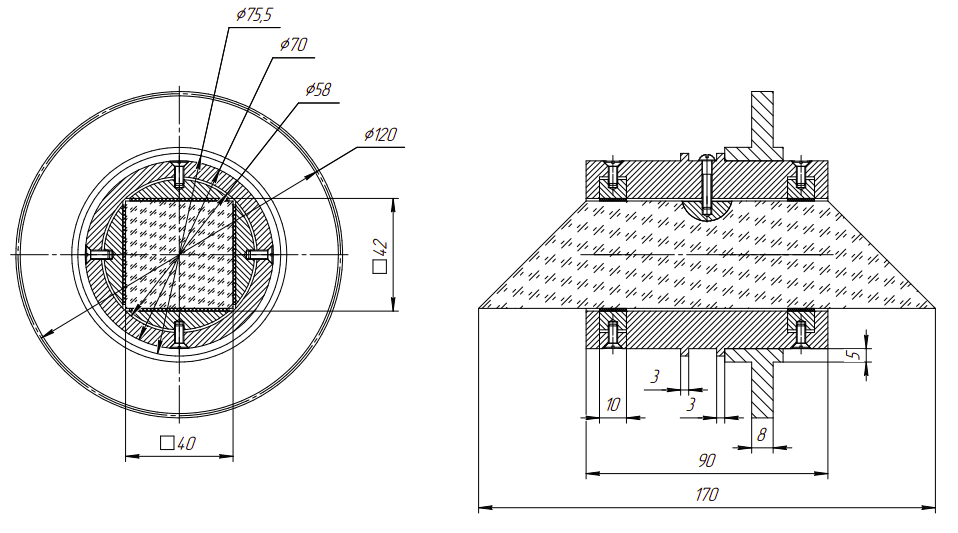

# 1. Введение

## 1.1. Техническое задание

| Наименование параметра        | Обозначение      | Значение |
| ---                           | ---              | --- |
| Диаметр светового потока на входе ОЭ                        |                  | 40 $мм$  |
| Максимальная скорость вращения ОЭ                     | $\omega_н$       | 1.4 $\frac{об.}{с}$ |
| Максимальное угловое 
ускорение вращения ОЭ           | $\varepsilon_н$  | 25 $с^{-2}$ |
| Максимальный угол поворота ОЭ | $\alpha_{{вых вала}}$ | 180$^\circ$ |
| Точность отработки положения ОЭ                              | $\delta_{{\Sigma ТЗ}}$ | 20$'$ |  |
| Рабочее положение оптической оси ОЭ                          |                  | Вертикальное |
| Характер производства         |                  | Серийное |
| Срок службы эксплуатации      | $L_{h}$          | 1000 $ч$ |
| Температура эксплуатации      | $t_{{жар}}$..$t_{{хол}}$     | +40..-40$^\circ С$ |

Таблица 1. Условия задания.

## 1.2. Описание разрабатываемого ЭМП

**Область применения**: устройства вращения изображения, проекционные приборы, оптические прицелы.

**Схема и краткое описание**:
ЭМП вращения изображения предназначен для поворота изображения предмета 
на произвольный угол с помощью вращающего оптического элемента (ОЭ), вращаемого
вокруг оптической оси ПУ.

Перемещение ОЭ осуществляется по сигналам, вырабатываемым
вычислительным устройством (ВУ), с помощью следящего привода, блок
схема которого приведена на рисунке 1. Следящая система представляет
собой замкнутый контур, состоящий из элемента сравнения ЭС, усилителя У,
исполнительного двигателя Д, редуктора Р с ОЭ , установленном на его
выходном звене, и элемента обратной связи ЭОС.

Ограничитель движения ОД входит в кинематическую цепь ЭМП для
ограничения пределов вращения визирного ОЭ.
Для поворота ОЭ с ВУ на вход следящей системы поступает сигнал
$U_{вх}$, значение которого соответствует вводимому углу азимута (угла
поворота ОЭ) $\phi_{ОЭ}$. После усиления сигнала $U_{вх}$ поступает на управляющую
обмотку двигателя.

Вал двигателя начинает вращаться и приводит в движение
кинематические цепи ЭМП. При вращении вала ЭОС вырабатывается
напряжение обратной связи $U_{ос}$ (противоположное по знаку $U_{вх}$), которое
поступает на ЭС, где сигналы суммируются. Результирующий сигнал (сигнал
ошибки) $\Delta U = U_{вх} - U_{ос}$ поступает на вход усилителя. Двигатель работает при
$\Delta U \neq 0$, стремясь все время поддерживать равенство $U_{вх} = U_{ос}$. При $\Delta U = 0$
двигатель останавливается, а при $\Delta U < 0$ - вращается в обратную сторону.
Таким образом, угол поворота ОЭ будет изменяться пропорционально
изменению величины входного сигнала $U_{вх}$.

На рисунке 2 приведена примерная кинематическая схема привода.
Движение от двигателя 1 с помощью двухступенчатого редуктора 
передается на выходное колесо $Z_4$, на котором установлен ОЭ. Элемент
обратной связи 2 соединяется с редуктором с помощью муфты 3. Для
вращения ОЭ в заданных пределах используется ограничитель движения ОД,
состоящий из микровыключателей 5 и механических упоров 6.

## 1.3. Дополнительные указания по проектированию

В записке необходимо приводить эскизы рассчитываемых элементов и
узлов схемы силовых воздействий, эпюры изгибающих и крутящих
моментов, а также эскизы компоновочной схемы механизма, варианты
схемотехнического состава привода. Привод выполнить в виде отдельного
законченного блока. В конструкции предусмотреть посадочные
конструктивные элементы для соединения с сопряженными деталями и
узлами ПУ. Электросоединение электрических элементов осуществить с
помощью стандартных элементов. Условия хранения - группа 2. Пытающая
сеть: сеть постоянного тока - U = 12 , 27, 29, 36 V, сеть переменного тока - U
= 36 V, f= 400 Гц. В качестве датчиков обратной связи использовать не
только потенциометры, но и оптические, магнитные датчики.

## 1.4. Анализ прототипов

Разрабатываемый привод является вращающим, следовательно,
ответственным, значит, принимая во внимание заданные техническим
заданием начальные данные, рассмотренный пример кинематической схемы
нас удовлетворяет. Возьмем его в качестве прототипа.
Из выбранной кинематической схемы получаем следующее:

- Компоновочная схема имеет один входной вал и два выходных,
это влияет на расчет требуемой мощности при выборе двигателя.
- Реверсивный характер движения выходных звеньев.
- Вращательный вид движения звеньев.
- Входной и выходной валы расположены параллельно, что
определяет использование цилиндрических передач.

В качестве элемента обратной связи (ЭОС) возьмем энкодер ЛИР-219А.01. 

В качестве ограничителей движения выберем микропереключатели KW1-103-3.
Привод должен разрабатываться с учетом оптического элемента, так
как определяющей является оптическая схема, вокруг которой и будет
создаваться устройство. В задании ОЭ является прямоугольная призма. В
приборе прямоугольная призма является визирной. Следовательно расчет и
проектирование ЭМП начнем с конструктивного оформления ОЭ.

# 2. Расчёт момента инерции крепления ОЭ

Для определения момента нагрузки и последующего расчета редуктора необходимо рассчитать момент инерции оптического элемента (призма Дове) и его крепления. Пренебрежём винтами, отверстиями под винты, шпонкой, прокладками между вкладышами и призмой в силу их малости. Чертеж крепления ОЭ изображен на рисунке 3:

## 2.1. Расчёт призмы

Примем 

| Наименование параметра | Обозначение | Значение |
| --- | --- | --- |
| Основная длина волны | $\lambda_0$ | 0.5893 [D] $мкм$ |
| Кратчаяшая волна спектра | $\lambda_1$ | 0.4800 [F'] $мкм$ |
| Длиннейшая волна спектра | $\lambda_2$ | 0.6438 [C'] $мкм$ |
| Марка стекла | --- | К8 |
| Показатель преломления на основной длине волны | $n_{\lambda_0}$ | 1.516300$^*$ |
| Показатель преломления на кратчайшей длине волны | $n_{\lambda_1}$ | 1.522406$^*$ |
| Показатель преломления на длиннейшей длине волны | $n_{\lambda_2}$ | 1.514293$^*$ |

Таблица 2. Оптические параметры призмы.

\*Данные получены из программы OPAL.

Если принять, что верхний луч на длине $\lambda_2$ попадает в верхних угол призмы
тогда:
$$
\frac{\sin (x - 90^\circ)}{\sin45^\circ} = \frac{1}{n_{\lambda_2}} \Rightarrow x = 117.83682^\circ
$$

Предполагая, что высота призмы $b$ равна световому диаметру, то:
$$
a = b(\tan(x-45^\circ) + 1)
$$

Отсюда $a = 169.51369 \approx 170 \ (мм)$

Назначим ширину призме равную ее высоте, $40 \ мм$.

## 2.2. Расчет момента инерции
Детали: призма, четыре вкладыша, шпонка, рама
вкладыши и раму будем считать полыми циллиндрами, шпонку считать не будем
остается призма

### 2.2.1. Призма

| Параметр              | Значение                      |
| ---                   | ---                           |
| Высота призмы         | $40 мм$                       |
| Ширина призмы         | $40 мм$                       |
| Длина нижней грани    | $170 мм$                      |
| Длина верхней грани   | $90 мм$                       |
| Материал              | Стекло К8                     |
| Плотность             | $2510 \frac{кг}{м^3}$         |
| Объём                 | $208.00 \cdot 10^{-6} \ м^3$  |
| Масса                 | $0.52208 \ кг$                |

Таблица 3. Параметры призмы.

Если разрезать призму и переместить уголки, то она будет иметь форму параллелограмма с квадратным сечением, имеющего такой же момент инерции. Такой параллелограмм будет иметь длину $130 мм$ и иметь момент
$$
J_{призмы} = \frac{1}{6} m b^2 = \frac{1}{6} 0.52208 \cdot (40 \cdot 10^{-3})^2 = \\
= 139.22 \cdot 10^{-6} \ (кг \cdot м^2)
$$

### 2.2.2. Вкладыши
Вкладыши будем рассматривать как два полных диска, в которых прорезаны квадратные отверстия.

#### Диск вкладыша:

| Параметр          | Значение                      |
| ---               | ---                           |
| Диаметр           | 56 $мм$                       |
| Толщина           | 10 $мм$                       |
| Материал          | Алюминий АД                   |
| Плотность         | 2710 $\frac{кг}{м^3}$         |
| Объём             | 24.630 $\cdot 10^{-6} \ м^3$  |
| Масса             | 0.066747 $кг$                 |

Таблица 4. Параметры диска вкладыша.

Момент инерции полного диска равен:
$$
J_{диска \ вкладыша} = \frac{1}{2} m R_{вкладыша}^2 = \frac{1}{2} 0.06675 \cdot (28 \cdot 10^{-3})^2 =\\
= 2.6166 \cdot 10^{-6} \ (кг \cdot м^2)
$$

#### Вырез:

| Параметр          | Значение                      |
| ---               | ---                           |
| Сторона квадрата  | 42 $мм$                       |
| Толщина           | 10 $мм$                       |
| Материал          | Алюминий АД                   |
| Плотность         | 2710 $\frac{кг}{м^3}$         |
| Объём             | 17.640 $\cdot 10^{-6} \ м^3$  |
| Масса             | 0.047804 $кг$                 |

Таблица 5. Параметры выреза вкладыша.

Момент выреза равен:
$$
J_{выреза \ вкладыша} = \frac{1}{6} m a_{выреза}^2 = \frac{1}{6} 0.047804 \cdot (42 \cdot 10^{-3})^2 =  \\
= 0.14054 \cdot 10^{-6} \ (кг \cdot м^2)
$$

Тогда общий момент вкладыша равен:
$$
J_{вкладыша} = J_{диска \ вкладыша} - J_{выреза \ вкладыша} =  \\
= 2.6166 - 0.14054 = 2.47606  \cdot 10^{-6} \ (кг \cdot м^2)
$$

### 2.2.3. Рама
Раму представим как сумму толстого кольца, сплошного цилиндра с вырезанным квадратным отверстием и двумя вырезанными дисками под вкладыши (их объемы считаем равным объемам вкладышей)

#### Цилиндр:

| Параметр          | Значение                      |
| ---               | ---                           |
| Диаметр           | 70 $мм$                       |
| Длина             | 90 $мм$                       |
| Материал          | Алюминий АД                   |
| Плотность         | 2710 $\frac{кг}{м^3}$         |
| Объём             | 1385.4 $\cdot 10^{-6} \ м^3$  |
| Масса             | 3.7544 $кг$                   |

Таблица 6. Параметры цилиндра рамы.

$$
J_{цилиндра \ рамы} = \frac{1}{2} m R_{цилиндра \ рамы}^2 = \frac{1}{2} 3.75443 \cdot (35 \cdot 10^{-3})^2 =  \\
= 2299.5 \cdot 10^{-8} \ (кг \cdot м^2)
$$

#### Квадратный вырез:

| Параметр          | Значение                      |
| ---               | ---                           |
| Сторона квадрата  | 42 $мм$                       |
| Толщина           | 90 $мм$                       |
| Материал          | Алюминий АД                   |
| Плотность         | 2710 $\frac{кг}{м^3}$         |
| Объём             | 158.76 $\cdot 10^{-6} \ м^3$  |
| Масса             | 0.43024 $кг$                  |

Таблица 7. Параметры квадратного выреза рамы.

$$
J_{выреза \ рамы} = \frac{1}{6} m a_{выреза}^2 = \frac{1}{6} 0.43024 \cdot (42 \cdot 10^{-3})^2 =  \\
= 126.49 \cdot 10^{-6} \ (кг \cdot м^2)
$$

#### Кольцо:

| Параметр          | Значение                      |
| ---               | ---                           |
| Внешний диаметр   | 75.5 $мм$                     |
| Внутренний диаметр | 70 $мм$                      |
| Толщина           | 8 $мм$                        |
| Материал          | Алюминий АД                   |
| Плотность         | 2710 $\frac{кг}{м^3}$         |
| Объём             | 5.0281 $\cdot 10^{-6} \ м^3$  |
| Масса             | 0.013626 $кг$                 |

Таблица 8. Параметры кольца рамы.

$$
J_{кольца \ рамы} = \frac{1}{2} m (R_{внешний}^2 + R_{внутренний}^2) =  \\
= \frac{1}{2} 0.013626 \cdot ((37.75 \cdot 10^{-3})^2 + (35 \cdot 10^{-3})^2) = \\
= 18.055 \cdot 10^{-6} \ (кг \cdot м^2)
$$

Тогда момент инерции рамы:
$$
J_{рамы} = J_{цилиндра \ рамы} + J_{кольца \ рамы} - J_{выреза \ рамы} - 2J_{вкладыша} =  \\
= (2299.5 + 18.055 - 126.49 - 2 \cdot 2.47606) \cdot 10^{-6} = \\
= 2186.1 \cdot 10^{-6}  \ (кг \cdot м^2)
$$

### 2.2.4. ЗК
Зубчатое колесо номер 4 состоит из диска с отверстием и толстого кольца.

#### Диск ЗК:

| Параметр          | Значение                      |
| ---               | ---                           |
| Внешний диаметр   | 120 $мм$                      |
| Внутренний диаметр | 80 $мм$                      |
| Толщина           | 8 $мм$                        |
| Материал          | Сталь 45                      |
| Плотность         | 7820 $\frac{кг}{м^3}$         |
| Объём             | 50.265 $\cdot 10^{-6} \ м^3$  |
| Масса             | 0.39307 $кг$                  |

Таблица 9. Параметры диска зубчатого колеса.

$$
J_{диска \ ЗК} = \frac{1}{2} m (R_{внешний}^2 + R_{внутренний}^2) =  \\
= \frac{1}{2} 0.39307 \cdot ((60 \cdot 10^{-3})^2 + (40 \cdot 10^{-3})^2) =  \\
= 1022.0 \cdot 10^{-6} \ (кг \cdot м^2)
$$

#### Кольцо ЗК:

| Параметр          | Значение                      |
| ---               | ---                           |
| Внешний диаметр   | 80 $мм$                       |
| Внутренний диаметр | 70 $мм$                      |
| Толщина           | 19.7 $мм$                     |
| Материал          | Сталь 45                      |
| Плотность         | 7820 $\frac{кг}{м^3}$         |
| Объём             | 23.209 $\cdot 10^{-6} \ м^3$  |
| Масса             | 0.18149 $кг$                  |

Таблица 10. Параметры кольца зубчатого колеса.

$$
J_{кольцо \ ЗК} = \frac{1}{2} m (R_{внешний}^2 + R_{внутренний}^2) =  \\
= \frac{1}{2} 0.18149 \cdot ((40 \cdot 10^{-3})^2 + (35 \cdot 10^{-3})^2) = 471.874 \cdot 10^{-6} \ (кг \cdot м^2)
$$

Тогда момент инерции зубчатого колеса:
$$
J_{ЗК} = J_{диска \ ЗК} + J_{кольца \ ЗК} = (1022.0 + 471.874) \cdot 10^{-6} =  \\
= 1493.87 \cdot 10^{-6} \ (кг \cdot м^2)
$$

Итого суммарный момент оптического элемента и его крепления:
$$ 
J_{н} = J_{призмы} + 2J_{вкладыша} + J_{рамы} + J_{ЗК} = \\
= (139.22 + 2 \cdot 2.47606 + 2186.1 + 1493.87) \cdot 10^{-6} =  \\
= 3824.1 \cdot 10^{-6} \ (кг \cdot м^2)
$$

Теперь рассчитаем все необходимые параметры для расчета редуктора.
Так как моменты датчика угла и микропереключателя достаточно малы
то примем $M_{стат} = 0.35 \ Н \cdot м$ куда включим и запас по моменту. 

$$
M_н = M_{дин} + M_{стат}
$$
$$
M_{дин} = \varepsilon_н \cdot J_н = 25 \cdot 3824.1 \cdot 10^{-6} = 0.095603 \ Н \cdot м
$$
$$
M_{стат} = 0.35 \ Н \cdot м
$$
$$
M_н = M_{дин} + M_{стат} = 0.35 + 0.095603 = 0.44560 \ Н \cdot м
$$
